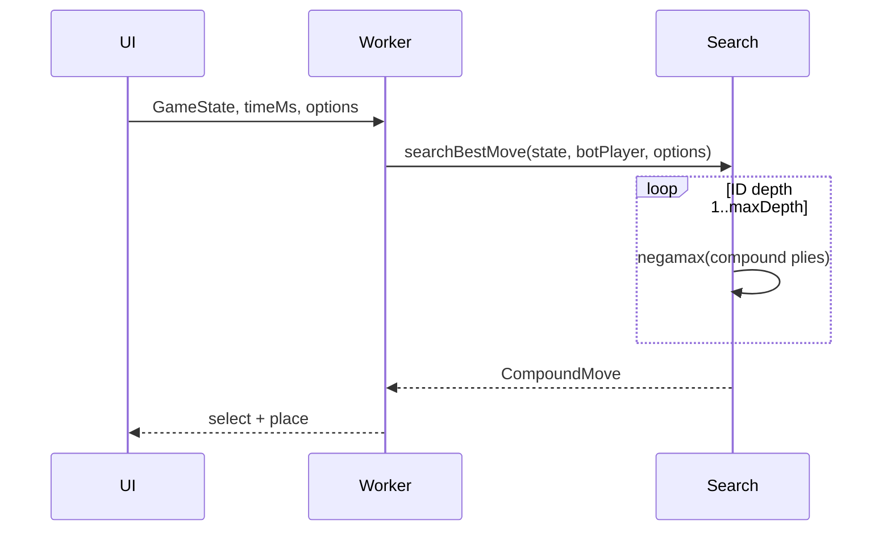

# Bot AI improvement — Implementation plan

**Status:** Draft v2 — ready to execute  
**Scope:** `@numchess/engine` (eval + search) + `scripts/*` sims + `apps/web` worker/difficulty  
**Parent:** [IMPLEMENTATION_PLAN.md](../IMPLEMENTATION_PLAN.md) §12 (Phase 6 → **6b**), [docs/RULES.md](./RULES.md) (`rulesVersion` **1.2.0**), [docs/BALANCE.md](./BALANCE.md)  
**Depends on:** [SPLIT_DIAGONALS_AND_LIVE_SCORING_V2_PLAN.md](./SPLIT_DIAGONALS_AND_LIVE_SCORING_V2_PLAN.md), [FLANKING_DIAGONALS_1_2_0_PLAN.md](./FLANKING_DIAGONALS_1_2_0_PLAN.md) (9 lines/side)  
**Follow-up:** [BOT_VS_STALL_AND_1_2_0_PLAN.md](./BOT_VS_STALL_AND_1_2_0_PLAN.md) — vs bot **stall** + flank-aware analysis + 1.2.0 sims (shipped)  
**Next:** [BOT_SEARCH_REVAMP_V3_PLAN.md](./BOT_SEARCH_REVAMP_V3_PLAN.md) — **canonical** bot architecture (supersedes search sections here for implementation)

### Revision history

| Version | Changes |
|---------|---------|
| **v1** | Eval alignment, ordering, search, sims (outline) |
| **v2** | Search ply model, magnitude budget, golden fixtures, `SearchOptions` API, TT hash spec, risks, CI, module split, playtest rubric |

---

## Table of contents

1. [Goals & principles](#1-goals--principles)  
2. [Search model (read first)](#2-search-model-read-first)  
3. [Baseline & gaps](#3-baseline--gaps)  
4. [Phase 0 — Baseline metrics](#4-phase-0--baseline-metrics)  
5. [Phase A — Evaluation](#5-phase-a--evaluation)  
6. [Phase B — Move ordering](#6-phase-b--move-ordering)  
7. [Phase C — Search engine](#7-phase-c--search-engine)  
8. [Phase D — Web worker](#8-phase-d--web-worker)  
9. [Phase E — Sims & tuning](#9-phase-e--sims--tuning)  
10. [Golden positions & tests](#10-golden-positions--tests)  
11. [Risks & mitigations](#11-risks--mitigations)  
12. [Files, API, acceptance](#12-files-api-acceptance)  
13. [FAQ](#13-faq)  
14. [Execution checklist](#14-execution-checklist)

---

## 1. Goals & principles

### 1.1 Player-visible outcomes

| Outcome | How we know |
|---------|-------------|
| Bot completes obvious **L5 diversity** on partial rows (e.g. five distinct values) | Golden fixture + manual playtest |
| Bot **blocks** opponent L5 when a single empty cell and tile exist in combined inventory | Golden fixture |
| **Hard** beats **Easy** consistently in `sim:bot-depth` | Scripted sim |
| Live HUD and bot “instinct” agree on what’s valuable | Eval uses same `scoreLinesFromBoard` as HUD |
| No UI jank | Search stays in worker; eval per node stays bounded |

### 1.2 Problems in current `ai.ts`

| Symptom | Root cause |
|---------|------------|
| Ignores partial 1–5 rows | `partialPerspectiveScore`: weighted levels only at **6/6**; partial uses `R*2 + D*3 + length` |
| Post-**1.1.0** blind spots on ↙/↘ | Diagonal **ownership** is correct in `getScoringLines`, but eval math is not live-aligned |
| Beatable by insight readers | No `analyzePositionForPlayer` bands in eval |
| Shallow tactics | `maxDepth: 5` fixed; weak ordering; no TT |
| No strength regression | Only `sim:bot` vs random |

### 1.3 Non-goals

- ML training, self-play datasets, GPU jobs  
- `rulesVersion` or legality changes  
- Ranked bot Elo / server-side AI  
- Solving Classic optimally (branching too high)  
- Opening book (defer unless sims show first-move meta)

### 1.4 Design principles

1. **One source of truth for points on the board:** `scoreLinesFromBoard` + `analyzeLine` (same as live HUD).  
2. **Insights are additive, not a second scorer:** threat bands nudge search; they must not overpower +1 L5 on the eval scale.  
3. **Time-bounded search:** always return best move from last **completed** ID depth on timeout.  
4. **Determinism in tests:** fixed seeds; no `Math.random` in Hard/Medium search paths.

---

## 2. Search model (read first)

Numchess turns are **select + place**, but the bot search tree uses **one ply = one compound move** `(tile, index)` via `getLegalCompoundMoves` / `applyCompoundMove`.



| Concept | Engine meaning |
|---------|----------------|
| **1 ply** | One compound move for the player to move |
| **Branching** | Up to ~180 at open; shrinks as board fills |
| **Horizon** | `maxDepth` compound plies ≈ that many full turns for each side |
| **Terminal** | `phase.ended` or board full → `evaluateGame` / stored result |

**Implication:** depth 4 ≈ 2 moves per side in compound form — shallow for endgame tactics; **ordering + eval quality** matter as much as raw depth.

---

## 3. Baseline & gaps

```text
useBotPlayer → bot.worker.ts → searchBestMove (packages/engine/src/ai.ts)
                                    ├─ negamax + α-β + ID + deadline
                                    └─ evaluatePosition (legacy partial heuristic)
```

| Knob | Today (`persistence.ts` + worker) |
|------|-------------------------------------|
| Easy | 200ms, `easyNoise: true` (random among top 3 one-ply) |
| Medium | 800ms, `maxDepth: 5` |
| Hard | 2000ms, `maxDepth: 5` |

| API already available (use, don’t reimplement) | Module |
|-----------------------------------------------|--------|
| `scoreLinesFromBoard`, `scoreLiveLevels`, `lineScoreDelta` | `scoring.ts` |
| `analyzePositionForPlayer`, `classifyLineBand` | `analysis.ts` |
| `compareLevelCounts`, `liveScoreLeader` | `winner.ts` / `scoring.ts` |

---

## 4. Phase 0 — Baseline metrics

**Goal:** Numbers before changing code (half day).

| Task | Output |
|------|--------|
| Run `pnpm sim:bot --games 100 --seed 42` | Record P2 win % in `docs/BALANCE.md` § Bot AI |
| Run `pnpm sim:random` | Confirm 1.1.0 row/col fairness unchanged |
| Micro-bench in Vitest (optional) | `evaluatePosition` calls/sec on midgame `createSandboxState()` |
| Log nodes at depth 2 on empty board (temporary `console` or test-only hook) | Baseline node count for ordering comparison |

**Do not block Phase A** on micro-bench; capture at least `sim:bot` baseline.

---

## 5. Phase A — Evaluation

### 5.1 Primary term: live level differential

```ts
// Conceptual — implement in evalLiveLevelDiff(state, rootPlayer)
const rows = scoreLinesFromBoard(state.board, "rows").counts;
const cols = scoreLinesFromBoard(state.board, "columns").counts;
const rowsW = weightedLevels(rows);  // existing LEVEL_WEIGHT in ai.ts
const colsW = weightedLevels(cols);
const material = rootPlayer === 1 ? rowsW - colsW : colsW - rowsW;
```

**Invariants (must have tests):**

| ID | Invariant |
|----|-----------|
| E1 | `createInitialState()` → `evaluatePosition(s, 1) === 0` and same for P2 |
| E2 | Board full → sign of `evaluatePosition` matches `compareLevelCounts` winner (or 0 draw) |
| E3 | Board full → `evalLiveLevelDiff` alone matches E2 without insight terms |
| E4 | `scoreLiveLevels(state)` counts match sum used in eval (no double-count) |

**Note:** On a **full** board, live counts from partial scoring **equal** `scoreBoth` / `evaluateGame` (each line has 6 cells). Midgame is where live eval helps.

### 5.2 Magnitude budget

Keep all midgame terms ≪ `WIN_SCORE` (1_000_000).

| Component | Suggested cap / scale |
|-----------|------------------------|
| One +1 **L5** contribution | `LEVEL_WEIGHT[5]` = 10_000 |
| Full lexicographic “feel” bonus | ≤ 2_000 (see §5.3) |
| All insight terms combined | ≤ 1_500 absolute |
| Typical midgame \|eval\| | Roughly 0 – 50_000 |

If insight terms exceed ~15% of a single L5 weight, the bot will chase ghosts over real points.

### 5.3 Lexicographic bonus (optional, Phase A.1)

Use `liveScoreLeader(scoreLiveLevels(state))`:

```text
if leader === root && decisiveLevel !== null:
  lexBonus = (6 - decisiveLevel) * 400   // L5 lead → +400, L4 → +800, …
else if leader === opponent:
  lexBonus = -(6 - decisiveLevel) * 400
else:
  lexBonus = 0
```

Tie when level counts equal at all tiers — bonus 0 (correct).

### 5.4 Insight term (inventory-aware)

Use **`analyzePositionForPlayer(state, rootPlayer)`** — final `band` already merges **opponent cross-line pressure** (`opponentPressureBand`).

| Band on **own** scoring line | Add to eval (for root) |
|------------------------------|-------------------------|
| `critical` | +`W_CRITICAL` (start 120) |
| `threat` | +`W_THREAT` (40) |
| `building` | +`W_BUILDING` (12) |
| `safe` | 0 |

| Band on **opponent** lines (analyze as `analyzePositionForPlayer(state, opp)`) | Subtract from root eval |
|--------------------------------------------------------------------------------|-------------------------|
| `critical` | `W_OPP_CRITICAL` (150) |
| `threat` | `W_OPP_THREAT` (50) |

**Do not** reimplement `canReachL5OnLine` in `ai.ts`. If insight eval is hot, cache per `(state hash, player)` inside search stack frame (optional Phase C).

### 5.5 `evaluatePosition` composition

```text
evaluatePosition(state, root) =
  terminal ? ±WIN_SCORE
  : material + lexBonus + insightBonus(state, root)
```

Remove `partialPerspectiveScore` once E1–E4 pass.

### 5.6 Module split (recommended)

| File | Contents |
|------|----------|
| `ai-eval.ts` | `evalLiveLevelDiff`, `evalInsightTerms`, `evaluatePosition`, `AI_EVAL_WEIGHTS` |
| `ai-search.ts` | `negamax`, TT, `searchBestMove`, ordering helpers |
| `ai.ts` | Compound moves + re-exports (keep public API stable in `index.ts`) |

Smaller diffs and faster review than a 400-line `ai.ts`.

### 5.7 Phase A acceptance

- [ ] E1–E4 tests green  
- [ ] Golden **G1** (partial L5 row) — eval increases for P1 (§10)  
- [ ] Golden **G2** (↘ only affects P1 eval) — §10  

---

## 6. Phase B — Move ordering

### 6.1 Sort key for each legal compound move

Compute once per move at the current node:

```text
next = applyCompoundMove(state, move)
delta = lineScoreDelta(state.board, next.board)
moverPerspective = rows if state.phase.player === 1 else columns
gain = contributionDeltaScore(delta, moverPerspective)  // sum LEVEL_WEIGHT[level] per new/changed contribution on mover's lines only
```

```ts
// contributionDeltaScore: for each entry in delta.player1 or delta.player2 matching mover,
// sum LEVEL_WEIGHT[c.level] for each contribution in entry.analysis.contributions
// (lineScoreDelta already filters to changed contribution keys)
```

**Sort descending:**

1. `gain` (contribution delta)  
2. `blocksOpponentCritical(state, move)` → 0 or 1 (see below)  
3. `evaluatePosition(next, rootPlayer)` one-ply  
4. `placeIndex` tie-break (prefer center: distance from (2.5, 2.5) on 6×6)

### 6.2 `blocksOpponentCritical`

```text
opp = opponent to move
For each opp scoring line where band === critical in analyzePositionForPlayer(state, opp):
  if move.place is the only empty index on that line → bonus flag
```

### 6.3 Easy mode

After full sort, `pickEasyNoisyMove` chooses uniformly among **top K** (K=3 default; K=5 if playtests say Easy still too strong).

### 6.4 Phase B acceptance

- [ ] In fixture **G1**, best move by sort places the fifth distinct value on row 0  
- [ ] Optional: node count at depth 2 on **G3** ≤ baseline from Phase 0  

---

## 7. Phase C — Search engine

### 7.1 `SearchOptions` (engine public type — extend)

```ts
export interface SearchOptions {
  timeMs?: number;
  maxDepth?: number;
  easyNoise?: boolean;
  /** Top-K random for easy; default 3 */
  easyTopK?: number;
  useTranspositionTable?: boolean;  // default true for medium/hard
  useQuiescence?: boolean;        // default false until Phase C.1
}
```

### 7.2 Transposition table

| Item | Spec |
|------|------|
| **Key** | 64-bit hash: Zobrist over 36 cells (6 tile values + empty), XOR inventory counts per player×tile, XOR `phase.kind` nibble + `toMove` |
| **Entry** | `{ depth, score, flag: 'exact'|'lower'|'upper', bestMove?: CompoundMove }` |
| **Policy** | Always replace if `new.depth >= old.depth`; table size 2^18 entries (~256k) |
| **Clear** | New `searchBestMove` call clears TT (no cross-turn pollution) |

Use stored `bestMove` as first move in ordering when `depth` matches remaining depth.

### 7.3 Iterative deepening

- Outer loop: `depth = 1 .. maxDepth` until `Date.now() >= deadline`.  
- Carry **root PV move** into next depth’s move list (move to front).  
- Return last **completed** depth’s best move (never return partial depth if zero completed — fall back to move 0 legal).

### 7.4 Depth caps (with worker)

| Difficulty | `timeMs` | `maxDepth` | `useTranspositionTable` |
|------------|----------|------------|-------------------------|
| easy | 200 | 3 | false (optional) |
| medium | 800 | 7 | true |
| hard | 2000 | 10 | true |

Depth 10 × compound plies is aspirational; time cutoff is the real limit.

### 7.5 Quiescence (Phase C.1 — optional)

Trigger only when `depth === 0` and `lineScoreDelta` non-empty for either side after the move:

- Generate **quiet** moves: only placements on lines that appear in delta ledgers **or** opponent `critical` lines.  
- Max **2** extra plies; no further recursion.  
- Use same `evaluatePosition` at quiescence leaves.

**Ship without quiescence** if schedule slips; document in CHANGELOG as follow-up.

### 7.6 Phase C acceptance

- [ ] TT hit test: transposition from different move order → same score  
- [ ] `searchBestMove` always legal on 100 random midgame states (property or loop)  
- [ ] No stack overflow at `maxDepth` 10 on empty board within 2s  

---

## 8. Phase D — Web worker

### 8.1 Worker message shape

```ts
export type BotWorkerRequest = {
  id: number;
  state: GameState;
  player: PlayerId;
  options: SearchOptions;  // replaces bare timeMs + easyNoise
};
```

### 8.2 `botSearchOptions(difficulty)` in `persistence.ts`

Single function returns full `SearchOptions` for worker — **one place** to tune product feel.

### 8.3 Backward compatibility

During migration, worker accepts legacy `{ timeMs, easyNoise }` if `options` absent (one release), then remove.

---

## 9. Phase E — Sims & tuning

### 9.1 Scripts

| npm script | Behavior | Pass threshold (initial) |
|------------|----------|---------------------------|
| `sim:bot` | P2 search vs P1 random, medium options | P2 wins **≥ 88%** (100 games, seed 42) |
| `sim:bot-vs-bot` | Same options both sides | P1 win 45–55% (variance OK) |
| `sim:bot-depth` | P1: 2000ms/d10 vs P2: 50ms/d2 | Deep wins **≥ 75%** |

CLI flags: `--games`, `--seed`, `--p1-ms`, `--p2-ms`, `--p1-depth`, `--p2-depth`.

### 9.2 Tuning loop

1. Adjust `AI_EVAL_WEIGHTS` only after a sim failure — one knob at a time.  
2. Record table in `docs/BALANCE.md`:

```markdown
## Bot AI (rulesVersion 1.1.0, engine x.y.z)

| Sim | Games | Seed | Result |
|-----|-------|------|--------|
| bot vs random | 100 | 42 | P2 91% |
| deep vs shallow | 50 | 42 | deep 78% |
```

3. **Easy** tuning: increase `easyTopK` or reduce medium eval weights — not search depth.

### 9.3 CI

- Keep `sim:random` in CI (fast).  
- Add **`sim:bot` with `--games 20`** as CI smoke (non-flaky threshold ≥ 75%) OR run nightly — document choice in `CONTRIBUTING.md`.

---

## 10. Golden positions & tests

Minimal **board fixtures** (add `packages/engine/__tests__/fixtures/ai-positions.ts` or inline in `ai-eval.test.ts`).

| ID | Setup | Expected behavior |
|----|--------|-------------------|
| **G1** | Row 0: `1,2,3,4` in first four cells; P1 to move; inventories default | Best move completes L5 diversity on row 0; eval(P1) > empty |
| **G2** | ↘ `diag-se` filled 1..5; P1 to move | Eval favors P1; placing on diag-se[5] increases live L5/L2 as appropriate |
| **G3** | Opponent col one away from L5 with tile left in inventory; you can block | `blocksOpponentCritical` move sorts above random fill |
| **G4** | `createSandboxState()` midgame | `searchBestMove` returns within 2s; move legal |

**Regression:** After Phase A, run one full random playout: at every ply, `scoreLiveLevels` matches manual sum (existing live-scoring tests).

---

## 11. Risks & mitigations

| Risk | Mitigation |
|------|------------|
| Eval too slow (7 lines × 2 perspectives × insights per node) | Profile; cache insights per state hash within a node; strip `building` in deep nodes (depth &lt; 3 only) if needed |
| TT hash collisions | 64-bit Zobrist; test collision rate on 10k random states |
| Easy still too hard | `easyTopK`, depth 2, disable TT |
| Hard still too weak | Raise `timeMs` to 3s cap in UI only after sims prove stability |
| Bot stalls worker | Hard deadline in negamax; never sync infinite loop |
| Insight double-count with material | Bands measure *potential*; keep W_* small vs LEVEL_WEIGHT |

---

## 12. Files, API, acceptance

### 12.1 File checklist

| File | Action |
|------|--------|
| `packages/engine/src/ai-eval.ts` | **New** — eval + weights |
| `packages/engine/src/ai-search.ts` | **New** — search + TT |
| `packages/engine/src/ai.ts` | Compound moves; thin re-export |
| `packages/engine/src/index.ts` | Export `SearchOptions` if widened |
| `packages/engine/__tests__/ai-eval.test.ts` | E1–E4, G1–G2 |
| `packages/engine/__tests__/ai.test.ts` | Search smoke + G4 |
| `scripts/sim-bot-vs-bot.ts`, `sim-bot-depth.ts` | **New** |
| `package.json` | npm scripts |
| `apps/web/src/workers/bot.worker.ts` | `options` payload |
| `apps/web/src/lib/persistence.ts` | `botSearchOptions` |
| `docs/BALANCE.md` | Baseline + post-tune tables |
| `packages/engine/CHANGELOG.md` | AI improvement (npm patch) |
| `CONTRIBUTING.md` | Optional CI sim note |

### 12.2 Ship acceptance

- [ ] `pnpm test` + new AI tests  
- [ ] Phase 0 baseline + Phase E thresholds documented  
- [ ] Manual playtest rubric (§14) signed off on Hard  
- [ ] Worker-only search unchanged from UI thread perspective  

### 12.3 Playtest rubric (5 minutes)

| # | Check |
|---|--------|
| 1 | Start vs Hard: bot does not throw; move within ~2s |
| 2 | You build 1–4 on a row; bot does not ignore obvious L5 if it can contest |
| 3 | Easy feels weaker than Hard (obvious blunders / slower) |
| 4 | Undo during bot turn: no duplicate moves / worker race (existing behavior preserved) |

---

## 13. FAQ

**Does this change `rulesVersion` or replays?**  
No. Only offline move choice changes.

**Why not train a neural net?**  
Classic has perfect engine rules and moderate branching; aligned eval + search is faster to ship and debug. ML remains a research fork.

**Use `scoreCompletedLines` for eval?**  
No — midgame needs partial contributions; completed-only repeats the HUD bug we fixed in 1.1.0.

**Does bot see hidden info?**  
No. Full `GameState` including both inventories is legal in perfect-information Classic.

---

## 14. Execution checklist

| Phase | Tasks |
|-------|--------|
| **0** | [ ] `sim:bot` + `sim:random` baseline → `BALANCE.md` |
| **A** | [ ] `ai-eval.ts`; E1–E4; G1–G2; remove `partialPerspectiveScore` |
| **A.1** | [ ] Lex bonus (optional) |
| **B** | [ ] `contributionDeltaScore` ordering; `blocksOpponentCritical`; easy top-K |
| **C** | [ ] `ai-search.ts`; TT; PV; depth table |
| **C.1** | [ ] Quiescence (optional) |
| **D** | [ ] `SearchOptions`; worker + `botSearchOptions` |
| **E** | [ ] New sims; tune weights; CHANGELOG; CI policy |

**Estimate:** Phase 0 (0.5d) + A (1–2d) + B (1d) + C (1–2d) + D (0.5d) + E (1d) → **~5–7 days**.

---

## 15. Future (out of scope)

- Opening diversity (penalize repeating same first compound move across games)  
- `adr/007-bot-eval-heuristic.md` if weights become contentious  
- Export search PV for “coach” UI showing bot’s top line  
