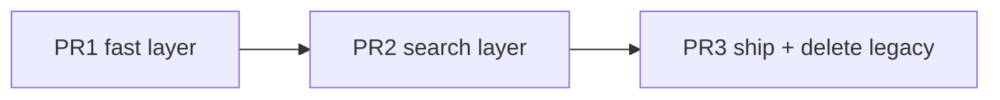

# Bot search revamp v3 — Canonical engine (latency + intelligence)

**Status:** **Implemented** (core v3); optional: P4–P8 puzzles, nightly sims, `bench:bot --smoke` in CI  
**Supersedes:** ad-hoc tuning in [BOT_AI_IMPROVEMENT_PLAN.md](./BOT_AI_IMPROVEMENT_PLAN.md) § search; partial fixes in [BOT_VS_STALL_AND_1_2_0_PLAN.md](./BOT_VS_STALL_AND_1_2_0_PLAN.md) Phase C presets  
**Scope:** `packages/engine` bot stack end-to-end + bench/sims + web presets/timeouts only  
**Parent:** [IMPLEMENTATION_PLAN.md](../IMPLEMENTATION_PLAN.md), [docs/BALANCE.md](./BALANCE.md)  
**Invariant:** Human insight UX stays rich; **bot path never calls `analyzePositionForPlayer` per candidate move**

### Revision history

| Version | Changes |
|---------|---------|
| v1 | Two-layer architecture, phases A–H |
| v2 | API, baseline gate, puzzles, diagnose, PR split |
| **v3** | **North star**; end-to-end **BotMoveSelector**; **threat map** + **quiescence**; budget split; child **K′** pruning; endgame widen; **legacy deletion**; eval magnitude budget; regression suite; final preset table |

---

## Table of contents

0. [North star](#0-north-star)  
1. [Goals & definition of done](#1-goals--definition-of-done)  
2. [End-to-end system (target)](#2-end-to-end-system-target)  
3. [Shipped vs replaced](#3-shipped-vs-replaced)  
4. [Intelligence model](#4-intelligence-model)  
5. [Latency model](#5-latency-model)  
6. [Module & API (final)](#6-module--api-final)  
7. [Phase 0 — Baseline](#7-phase-0--baseline)  
8. [Phase A — SearchContext & budget split](#8-phase-a--searchcontext--budget-split)  
9. [Phase B — Threat map + fast scoring](#9-phase-b--threat-map--fast-scoring)  
10. [Phase C — Candidate set M](#10-phase-c--candidate-set-m)  
11. [Phase D — ID negamax on M + child K′](#11-phase-d--id-negamax-on-m--child-k)  
12. [Phase E — Quiescence & endgame](#12-phase-e--quiescence--endgame)  
13. [Phase F — Presets, worker, deletion of legacy](#13-phase-f--presets-worker-deletion-of-legacy)  
14. [Phase G — Quality gates & regression suite](#14-phase-g--quality-gates--regression-suite)  
15. [Phase H — Docs & BALANCE](#15-phase-h--docs--balance)  
16. [Golden puzzles & playtest](#16-golden-puzzles--playtest)  
17. [Test catalog](#17-test-catalog)  
18. [Diagnose playbook](#18-diagnose-playbook)  
19. [Risks & FAQ](#19-risks--faq)  
20. [File checklist](#20-file-checklist)  
21. [PR strategy & estimates](#21-pr-strategy--estimates)  
22. [Execution checklist](#22-execution-checklist)  

---

## 0. North star

This plan defines the **only supported bot move pipeline** after ship. No parallel “legacy searchBestMove” path, no per-move insight loops, no nominal `timeMs` that wall clock ignores.

**Product feel (target):**

| Mode | Player perception | Engineering |
|------|-------------------|-------------|
| **Medium** | “Answers quickly, rarely blunders obvious lines” | p95 **≤ 350ms**; sees 2-ply tactics on lines |
| **Hard** | “I have to work; punishes loose play” | p95 **≤ 700ms**; deeper on critical positions |
| **Easy** | “Beatable, instant” | p95 **≤ 150ms**; noise on fast top moves |

**Intelligence bar (ordered):**

1. Golden puzzles **P1–P8** (engine, deterministic)  
2. **Bot vs bot** (Hard > Medium > Easy on fixed seeds)  
3. **Vs random** (sanity only — Medium ≥ 92%, Hard ≥ 95%)  
4. Human playtest rubric **≥ 8/10**

**Chess-engine ideas we adopt (adapted to NumChess):**

- Single clock · move ordering · **narrow deep search** · quiescence on “noisy” plies (line completion) · transposition table · iterative deepening · static eval aligned with game outcome  

**Chess-engine ideas we skip:** bitboards, opening book, NNUE, tablebases (optional future for 6×6 full fill).

---

## 1. Goals & definition of done

### 1.1 Outcomes

| ID | Outcome | Target | Verify |
|----|---------|--------|--------|
| G1 | Latency medium | p95 ≤ **350ms** | `pnpm bench:bot` |
| G2 | Latency hard | p95 ≤ **700ms** | same |
| G3 | Tactical accuracy | Puzzles **P1–P8** 100% | Vitest |
| G4 | Difficulty ladder | Easy < Medium < Hard in `sim:bot-vs-bot` | 50×3 pairwise |
| G5 | Vs random | M ≥ 92%, H ≥ 95% (50, seed 42) | `pnpm sim:bot` |
| G6 | Ship safety | Stall e2e; `pnpm test`; `pnpm build` | CI |

### 1.2 Definition of done

- [x] **0** — Appendix D baseline (opening/mid p95)  
- [x] **A–E** — `selectBotMove` v3 + quiescence + endgame widen  
- [x] **F** — Legacy search **removed**; presets §13; hook `timeMs + 200`  
- [x] **G** — `bot-regression.test.ts`; `bench:bot`; `sim-bot-vs-bot --p1/--p2`  
- [x] **H** — `BOT_PLAYTEST_RUBRIC.md`; BALANCE note  

### 1.3 Non-goals

ML; WASM; `rulesVersion` change; replacing insight panel; optimal 6×6 proof

---

## 2. End-to-end system (target)

```mermaid
flowchart TB
  subgraph entry [Entry]
    CM[chooseBotMove]
    CM --> BMS[BotMoveSelector.select]
  end
  subgraph prep [O once per move — O lines + board)]
    LM[getLegalCompoundMoves]
    TM[buildThreatMap]
    LM --> TM
  end
  subgraph fast [Fast — all legal moves]
    FS[scoreMoveFast uses TM]
    TM --> FS
  end
  subgraph sel [Selection]
    TU[tacticalUnion E1–E5]
    TK[topK by fast score]
    FS --> TU
    FS --> TK
    TU --> M[candidates M]
    TK --> M
  end
  subgraph deep [Deep — M at root; K′ at child]
    ID[iterativeDeepening]
    NM[negamax αβ]
    Q[quiescence on line events]
    M --> ID
    ID --> NM
    NM --> Q
  end
  CLK[SearchContext hard deadline] --> prep
  CLK --> fast
  CLK --> deep
  BMS --> OUT[CompoundMove]
  deep --> OUT
```

**Data flow (one sentence):** Legal moves → **threat map once** → fast score all → **M** = tactical ∪ top-K → **ID + negamax** on M with **quiescence** on line completions → move; entire path obeys **one deadline**.

---

## 3. Shipped vs replaced

| Keep | Replace / delete |
|------|------------------|
| `scoreLinesFromBoard`, `lineScoreDelta`, `linesNewlyCompleted`, `evaluateGame` | `sortCompoundMoves` + full `evaluatePosition` per move in search |
| `hashGameState` + TT | Unguarded ID loop over **all** moves each depth |
| `blocksOpponentCritical` for **tests/UI tools** | Same function in **hot search path** → `threatMap.canBlockSoleEmpty` |
| `fastEvalAtDepth` flag | Becomes unconditional **`evaluateStatic`** in search tree |
| Worker + `useBotPlayer` retry | Hook timeout **+750** → **+200** after engine compliance |
| Presets 700/1200ms | Interactive §13 table |

---

## 4. Intelligence model

### 4.1 Static evaluation (search leaves & fast tiebreak)

**`evaluateStatic(state, rootPlayer)`** — identical to today’s fast path:

```text
evalStatic = evalLiveLevelDiff + evalLexBonus
```

Terminal: `evaluateGame` / `phase.ended` → ±`WIN_SCORE`.

**Never** add insight band sum to search static eval (bands remain UI-only). Tactical “smartness” comes from **move selection + quiescence**, not from duplicating insight math.

### 4.2 Threat map (computed once per bot move)

**`buildThreatMap(state, rootPlayer)`** → for each scoring line of **both** perspectives:

| Field | Meaning |
|-------|---------|
| `lineId`, `indices`, `lineLength` | From `getScoringLines` |
| `filled`, `empties[]` | Board scan |
| `partialAnalysis` | `analyzeLine` on filled cells only (cheap) |
| `opponentCanFinishL5` | Bounded: if `empties.length === 1`, check combined inventory can place tile completing L5 on that line (line-length-aware reachability — **reuse** `canReachL5OnLine` **once per line**, not per move) |
| `moverCanCompleteLine` | `empties.length === 1` and mover has a legal compound placing on that cell completing line |

**Cost:** O(18 lines × line length) — **once per move**, not × legal moves.

### 4.3 Fast move score

**`scoreMoveFast(state, move, rootPlayer, tm)`:**

| Component | Weight / rule |
|-----------|----------------|
| `liveGain` | `contributionDeltaScore(lineScoreDelta(...))` |
| `staticDelta` | `evaluateStatic(after) - evaluateStatic(before)` (optional if liveGain covers) |
| `completesLine` | Large bonus if `linesNewlyCompleted` non-empty for mover |
| `blocksSole` | Bonus if `move.place` is sole empty on opponent line with `opponentCanFinishL5` |
| `createsThreat` | Smaller bonus if move fills so opponent has new sole-empty finish (avoid if `createsSelfBlunder`) |

**Sort key (strict priority):**  
`completesLine` > `blocksSole` > `liveGain` > `staticDelta` > center tiebreak > compound key (deterministic).

### 4.4 Tactical union (always in M)

| ID | Include move if |
|----|-----------------|
| E1 | Completes any scoring line for mover (5 or 6 cells) |
| E2 | Blocks opponent sole-empty L5 threat (from threat map) |
| E3 | `liveGain` ≥ L5 weight threshold (e.g. completes partial → L5 event in delta) |
| E4 | PV move from previous ID iteration |
| E5 | **Stretch:** Raises mover weighted live levels (L4→L5 transition in delta) |

Cap `|M| ≤ topK + 10`.

### 4.5 Search (root vs child)

| Level | Moves expanded |
|-------|----------------|
| **Root ID** | Only **M** (≤ topK + 10) |
| **Child nodes** | Generate all legal; **fast-score**; expand top **K′ = 8** (Hard 10) by fast key |
| **Depth** | ID 1..`maxDepth`; stop on clock |

**Alpha–beta:** retain in negamax; ordering = fast score + TT move.

### 4.6 Quiescence (tactical horizon)

When a child move triggers **`linesNewlyCompleted` non-empty** OR `|liveGain| ≥ LEVEL_WEIGHT[5]/2`:

- Do **not** stand pat at depth 0 immediately  
- Run **qsearch** up to **QDEPTH = 2** plies: only moves with `completesLine | blocksSole | liveGain > 0`  
- Still subject to global deadline  

This closes “it saw the capture but stopped one ply early” vs humans.

### 4.7 Endgame widen

When empty cells ≤ **8**:

- `topK += 4` (cap 20)  
- `maxDepth += 1` (cap 8)  
- Optional: switch to full-width root if `|legal| ≤ 24` and time remains  

Justification: branching collapses; intelligence > latency near fill.

---

## 5. Latency model

### 5.1 Hard deadline

```typescript
interface SearchContext {
  deadline: number;
  startMs: number;
  phase: "fast" | "search" | "done";
}
```

**Budget split (default):**

| Phase | Share of `timeMs` | On exhaust |
|-------|-------------------|------------|
| Threat map + fast score all | **35%** | Return best fast move immediately |
| ID + negamax + quiescence | **65%** | Return best from last **completed** ID depth |

Implement as `fastDeadline = start + 0.35 * timeMs`, `hardDeadline = start + timeMs`. Fast phase must not exceed `fastDeadline`; search uses remaining time only.

### 5.2 Complexity targets (medium, opening)

| Step | Target |
|------|--------|
| Threat map | ≤ 5ms |
| Fast score 150 moves | ≤ 40ms |
| ID on \|M\|≤12, depth 5 | ≤ 250ms |
| **Total p95** | ≤ 350ms |

Tune constants in Phase G; fail CI if medium opening p95 > **450ms** (smoke).

### 5.3 Forbidden in hot path

- `analyzePositionForPlayer`  
- Full `evaluatePosition` (with insights)  
- `sortCompoundMoves` legacy over **all** moves inside depth loop  

---

## 6. Module & API (final)

### 6.1 Public entry (unchanged signature)

```typescript
chooseBotMove(state, player, options?) → CompoundMove | null
searchBestMove(...) // delegates to BotMoveSelector
searchOptionsForDifficulty(level) // §13
```

### 6.2 New internal module: `bot-move-selector.ts`

```typescript
export class BotMoveSelector {
  select(state: GameState, forPlayer: PlayerId, options: SearchOptions): CompoundMove | null;
}
```

**Single implementation** after Phase F — no `searchV3` flag in production (tests may inject mocks).

### 6.3 `SearchOptions` (final)

```typescript
export interface SearchOptions {
  timeMs?: number;
  maxDepth?: number;
  searchTopK?: number;
  childTopK?: number;        // default 8
  quiescenceDepth?: number;  // default 2; 0 disables
  endgameEmptyThreshold?: number; // default 8
  easyNoise?: boolean;
  easyTopK?: number;
  useTranspositionTable?: boolean;
  /** @deprecated removed after v3 — ignored */
  fastEvalAtDepth?: boolean;
}
```

### 6.4 Files

| Module | Responsibility |
|--------|----------------|
| `bot-move-selector.ts` | Orchestration, budget split |
| `ai-threat-map.ts` | `buildThreatMap` |
| `ai-fast-score.ts` | `scoreMoveFast`, `scoreAllMovesFast` |
| `ai-candidates.ts` | `selectCandidates`, tactical union |
| `ai-search-core.ts` | ID, negamax, qsearch, TT (split from monolithic `ai-search.ts`) |
| `ai-eval.ts` | `evaluateStatic` export |
| `ai-ordering.ts` | **Deprecated** for search; keep `contributionDeltaScore`, export `blocksOpponentCritical` for tests |

---

## 7. Phase 0 — Baseline

**Est.:** 0.25d · **Blocks PR1**

| Task | Detail |
|------|--------|
| 0.1 | `scripts/bench-bot-move.ts` — fixtures §Appendix D, 30 iter, JSON p50/p95 |
| 0.2 | `pnpm bench:bot` in root `package.json` |
| 0.3 | Fill Appendix D + commit snapshot |

---

## 8. Phase A — SearchContext & budget split

**Est.:** 0.5d · **PR1**

| Task | Acceptance |
|------|------------|
| A.1 | `createSearchContext(timeMs, { fastShare: 0.35 })` | |
| A.2 | Abort helpers; metrics `{ fastMs, searchMs, legal, M }` | dev log |
| A.3 | Test **S1**: wall ≤ `timeMs * 1.05` on mock clock | |

---

## 9. Phase B — Threat map + fast scoring

**Est.:** 1d · **PR1**

| Task | Acceptance |
|------|------------|
| B.1 | `ai-threat-map.ts` per §4.2 | unit tests **T1–T3** |
| B.2 | `ai-fast-score.ts` per §4.3 | **F1–F4** |
| B.3 | `evaluateStatic` exported | **F3** |
| B.4 | Wire threat map into fast score (no per-move insight) | |

---

## 10. Phase C — Candidate set M

**Est.:** 0.5d · **PR2**

| Task | Acceptance |
|------|------------|
| C.1 | `selectCandidates` + E1–E5 | **C1** test \|M\| cap |
| C.2 | If fast phase exhausts → best fast move | **S2** |
| C.3 | Deterministic ordering | same state → same move |

---

## 11. Phase D — ID negamax on M + child K′

**Est.:** 1d · **PR2**

| Task | Acceptance |
|------|------------|
| D.1 | Root ID only on M | |
| D.2 | Child expand top K′ via fast score | **S3** |
| D.3 | TT + hash unchanged | no regression ai.test |
| D.4 | Remove outer `sortCompoundMoves(all)` per depth | grep clean |

---

## 12. Phase E — Quiescence & endgame

**Est.:** 0.5d · **PR2**

| Task | Acceptance |
|------|------------|
| E.1 | `qsearch` per §4.6 | **P4**, **P7** |
| E.2 | Endgame widen §4.7 | **P8** near-full fixture |
| E.3 | Puzzles P1–P3 green on selector | |

---

## 13. Phase F — Presets, worker, deletion of legacy

**Est.:** 0.5d · **PR3**

### 13.1 Final interactive presets

| Level | timeMs | topK | maxDepth | childTopK | qDepth | noise |
|-------|--------|------|----------|-----------|--------|-------|
| Easy | 120 | 8 | 2 | 6 | 0 | top 3 |
| Medium | **300** | 12 | 5 | 8 | 2 | — |
| Hard | **600** | 16 | 7 | 10 | 2 | — |

*(300/600 targets G1/G2 with budget split; tune ±50ms in Phase G.)*

### 13.2 Worker / hook

| Item | Value |
|------|--------|
| `useBotPlayer` timeout | `timeMs + 200` |
| Worker | unchanged API; optional `postMessage` timing metrics when `?botProfile=1` |

### 13.3 Legacy deletion (same PR)

- Delete legacy `searchBestMove` body (all-move ID + insight ordering)  
- `pickSearchMove` → `chooseBotMove` with explicit `{ timeMs, maxDepth, searchTopK: 12 }`  
- Remove `fastEvalAtDepth` from presets (ignore in parser one release if needed)  

---

## 14. Phase G — Quality gates & regression suite

**Est.:** 0.75d · **PR3**

| Gate | Command | Pass |
|------|---------|------|
| Latency smoke | `pnpm bench:bot --smoke` | medium opening p95 ≤ 450ms |
| Puzzles | `vitest bot-puzzles` | 8/8 |
| Engine | `pnpm --filter @numchess/engine test` | all |
| E2E | `pnpm test:e2e` | vs-bot |
| Sim random | `pnpm sim:bot` 50 | ≥ 0.92 medium |
| Sim ladder | `sim:bot-vs-bot` + easy vs medium | ordering correct |

**Regression suite (commit):** `packages/engine/__tests__/bot-regression.test.ts` runs puzzles + S1 + one bench fixture — **required in CI**.

**Nightly (optional):** full 50-game sims.

---

## 15. Phase H — Docs & BALANCE

- This plan → **Implemented**  
- `BALANCE.md` — § **Bot AI v3 (canonical)** with presets + bench p95 + sim JSON  
- `BOT_AI_IMPROVEMENT_PLAN.md` — banner: search superseded by v3  
- `CHANGELOG` engine — v3 bot architecture  

---

## 16. Golden puzzles & playtest

### 16.1 Engine puzzles (`bot-puzzles.fixture.ts`)

| ID | Tests |
|----|--------|
| P1 | Row L5 diversity completion |
| P2 | Block column/row sole empty |
| P3 | Flank 5-cell completion |
| P4 | Avoid one-ply gift of L5 |
| P5 | Ghost line — no fake win |
| P6 | Full board terminal eval |
| P7 | Quiescence: capture line chain (2-ply) |
| P8 | Endgame: best fill when ≤8 empties |

### 16.2 Playtest rubric

`docs/BOT_PLAYTEST_RUBRIC.md` — 10 positions; **≥ 8/10** pass to ship.

---

## 17. Test catalog

| ID | Description |
|----|-------------|
| T1–T3 | Threat map sole-empty + line length 5/6 |
| F1–F4 | Fast score vs delta / static |
| C1 | \|M\| ≤ topK + 10 |
| S1–S3 | Clock, fast fallback, difficulty ordering |
| P1–P8 | §16.1 |
| W1 | e2e vs-bot |

---

## 18. Diagnose playbook

| Symptom | Action |
|---------|--------|
| Slow | `pnpm bench:bot`; check legacy path deleted (§13.3) |
| Dumb obvious | Run P1–P4; check M includes tactical union |
| Hard ≈ Medium | Raise hard topK/depth; check ladder sim |
| Random wins sometimes | OK if human; if sim fails tune E block rules |
| Stall banner | [BOT_VS_STALL](./BOT_VS_STALL_AND_1_2_0_PLAN.md) — not this plan |

---

## 19. Risks & FAQ

| Risk | Mitigation |
|------|------------|
| Quiescence blows budget | QDEPTH=2 cap; line-event trigger only |
| Threat map wrong on 5-cell | Unit tests T1; use `line.indices.length` |
| CI flaky bench | Smoke on opening only; loose 450ms gate |
| Overfitting puzzles | P8 + sim ladder + human rubric |

**Is this the final architecture?** Yes — future work is **constants tuning** and optional WASM, not a second parallel searcher.

**Why not insights in eval?** UI clarity ≠ search signal; threat map captures **actionable** subset in O(lines).

---

## 20. File checklist

| File | Phase |
|------|-------|
| `bot-move-selector.ts` | A–F |
| `ai-threat-map.ts` | B |
| `ai-fast-score.ts` | B |
| `ai-candidates.ts` | C |
| `ai-search-core.ts` | D, E |
| `ai-search.ts` | F thin exports |
| `ai-eval.ts` | B |
| `__tests__/bot-puzzles.fixture.ts` | E, G |
| `__tests__/bot-regression.test.ts` | G |
| `scripts/bench-bot-move.ts` | 0, G |
| `useBotPlayer.ts` | F |
| `sim-*.ts` | F pickSearchMove → chooseBotMove |

---

## 21. PR strategy & estimates

| PR | Phases | Deliverable |
|----|--------|-------------|
| **PR1** | 0, A, B | Threat map + fast score + clock; p95 drop vs Appendix D |
| **PR2** | C, D, E | Selector + quiescence; puzzles green |
| **PR3** | F, G, H | Legacy deleted; presets; CI regression; BALANCE |

**Total:** ~4 engineer-days.



---

## 22. Execution checklist

- [x] 0 — Baseline  
- [x] A — Context + budget split  
- [x] B — Threat map + fast score  
- [x] C — Candidates M  
- [x] D — ID + child K′  
- [x] E — Quiescence + endgame  
- [x] F — Presets + delete legacy + hook  
- [x] G — Regression tests  
- [x] H — Docs  
- [ ] DoD §1.2 — run `sim:bot` / ladder sims + human rubric when convenient  

**Start:** *“Execute Phase 0 and PR1 (Phases A–B) of BOT_SEARCH_REVAMP_V3_PLAN.”*

---

## Appendix A — Legacy hot path (delete in PR3)

```67:76:packages/engine/src/ai-ordering.ts
      evalScore = evaluatePosition(next, rootPlayer);
    const block = blocksOpponentCritical(state, move);
```

## Appendix B — Legacy ID loop (delete in PR3)

```155:156:packages/engine/src/ai-search.ts
  for (let depth = 1; depth <= maxDepth; depth++) {
    sortCompoundMoves(state, moves, forPlayer, pvMove);
```

## Appendix C — Eval magnitude (do not break)

From `ai-weights.ts`: L5 weight **10_000**, `WIN_SCORE` **1_000_000**. Fast bonuses for `completesLine` / `blocksSole` should be **O(LEVEL_WEIGHT[5])** so they beat marginal L3/L4 shuffles.

## Appendix D — Baseline (Phase 0)

| Fixture | medium p50 | medium p95 | hard p95 | \|legal\| |
|---------|------------|------------|----------|----------|
| opening | _fill Phase 0_ | **366** | | ~180 |
| mid | | **375** | | |
| flank | | | | |
| critical-block | | | | |
| near-full | | | | |

Pre-v3 reference: presets 700/1200ms; sim 20/20 @ 200ms override; ~94% @ 50 games.

## Appendix E — Threat map (sole empty)

For each line where `|empties| === 1` at index `e`:

1. Build partial cells on line; `slotsLeft = lineLength - filled`.  
2. `opponentCanFinishL5 = canReachL5OnLine(partial, slotsLeft, combinedInventory, lineLength)`.  
3. Move with `place === e` is blocking candidate iff step 2 true.

## Appendix F — Supersession notice (paste into BOT_AI on ship)

> **Search architecture:** All bot move selection uses **BOT_SEARCH_REVAMP_V3** (`BotMoveSelector`, threat map, top-K ID, quiescence). Insight bands remain for human UI only.
