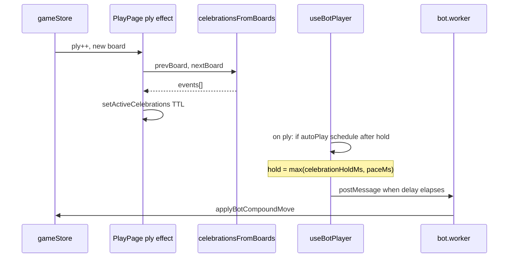

# Bot spectator mode & L4/L5 line celebration

**Status:** **Implemented** (web); optional: web Vitest for `lineCelebration`, full manual QA §15.3  
**Scope:** `apps/web` (Play UI, hooks, board FX, settings, tests, a11y notes) — **no** engine rule or search changes  
**Parent:** [IMPLEMENTATION_PLAN.md](../IMPLEMENTATION_PLAN.md), [docs/BALANCE.md](./BALANCE.md)  
**Related:** [VS_BOT_MODE_FIX_PLAN.md](./VS_BOT_MODE_FIX_PLAN.md) (`useBotPlayer`, gating), [LIVE_SCORING_AND_AUDIO_PLAN.md](./LIVE_SCORING_AND_AUDIO_PLAN.md) (`lineScoreDelta`, score feed), [ACCESSIBILITY.md](./ACCESSIBILITY.md) (motion, live regions), `scripts/sim-bot-vs-bot.ts` (CLI ladder)

### Revision history

| Version | Changes |
|---------|---------|
| v1 | Bot vs bot watch mode + pause/play; L4/L5 board celebration; phases, DoD, tests |
| **v2** | Code baseline & hook refactor spec; celebration diff algorithm; timing constants; a11y; QA script; resolved open decisions; test IDs; undo/mode matrix |

---

## Table of contents

0. [North star](#0-north-star)  
1. [Problem & product intent](#1-problem--product-intent)  
2. [Current baseline (code)](#2-current-baseline-code)  
3. [Goals & definition of done](#3-goals--definition-of-done)  
4. [Non-goals](#4-non-goals)  
5. [Feature A — Bot spectator](#5-feature-a--bot-spectator)  
6. [Feature B — L4/L5 line celebration](#6-feature-b--l4l5-line-celebration)  
7. [Shared architecture & timing](#7-shared-architecture--timing)  
8. [Accessibility & motion](#8-accessibility--motion)  
9. [Phase 0 — Design locks (resolved)](#9-phase-0--design-locks-resolved)  
10. [Phase 1 — Settings & mode shell](#10-phase-1--settings--mode-shell)  
11. [Phase 2 — Dual-bot driver](#11-phase-2--dual-bot-driver)  
12. [Phase 3 — UX, transport, gating](#12-phase-3--ux-transport-gating)  
13. [Phase 4 — Celebration pipeline](#13-phase-4--celebration-pipeline)  
14. [Phase 5 — Bot ↔ celebration scheduling](#14-phase-5--bot--celebration-scheduling)  
15. [Phase 6 — Tests, QA, docs](#15-phase-6--tests-qa-docs)  
16. [Behavior matrix (undo / mode / end)](#16-behavior-matrix-undo--mode--end)  
17. [Risks & FAQ](#17-risks--faq)  
18. [File checklist](#18-file-checklist)  
19. [PR strategy & estimates](#19-pr-strategy--estimates)  
20. [Execution checklist](#20-execution-checklist)

---

## 0. North star

**Spectator:** A casual player can open **Bot vs bot**, pick **P1 / P2 difficulty**, hit **Play**, and watch a full game on the real board with the same worker-backed moves as **Vs bot** — with **Pause** when they want to read the position, without ever touching inventories.

**Celebration:** When live scoring **first earns L4 or L5** on a line (rows for P1, cols for P2), the **cells on that line** briefly **radiate and fade** so high-level locks read as events, not spreadsheet updates.

**Invariant:** Vs bot reliability (retry, timeout, `turn-bot-thinking`) must not regress.

---

## 1. Problem & product intent

| Need | Today | Target |
|------|--------|--------|
| Two bots on the board | CLI `scripts/sim-bot-vs-bot.ts` | In-app **Bot vs bot** + transport |
| Pause / resume | N/A | Pause stops **scheduling**; Play resumes |
| Watchable pacing | Instant plies if ungated | Configurable **pace** after each ply |
| L4/L5 payoff | Score feed + `pulseKey` + optional `level_4` / `level_5` SFX | **Board-level** radiate on line cells |
| a11y | `reduceMotion` + settings | Celebrations respect both; no seizure-y strobing |

---

## 2. Current baseline (code)

What exists today — implementers should not rediscover these constraints.

| Area | Location | Relevant behavior |
|------|----------|-------------------|
| Modes | `persistence.ts` | `GameMode = "local2p" \| "vsBot" \| "sandbox"` only |
| Bot hook | `useBotPlayer.ts` | Runs **only** when `mode === "vsBot"`; worker torn down otherwise |
| Schedule gate | `scheduleBotMove` | Early `if (modeRef.current !== "vsBot") return` |
| Apply guard | `applyMovePayload` | Requires `current.phase.player === botSeatRef` (single seat) |
| Human input | `playVsBot.ts` `canHumanAct` | Only vs-bot gating; local 2P always acts |
| Ply side effects | `PlayPage.tsx` | `lineScoreDelta` → score feed, `playLineLockFanfare`, `pulseKey` |
| Audio L4/L5 | `useGameAudio.ts` | `maxContributionLevel` → `level_4` / `level_5` SFX per line id (debounced per line) |
| Board motion | `Board.tsx`, `index.css` | `place`, `pulse-place`; reduce-motion hooks |
| E2E vs bot | `e2e/vs-bot.spec.ts` | `mode-vsbot`, `turn-bot-thinking`, filled cells ≥ 2 |
| Web unit tests | — | **None** today; engine uses Vitest (`pnpm --filter @numchess/engine test`) |

**Implication:** Spectator is not a small UI toggle — it requires **generalizing the bot hook** (automated seats + per-seat difficulty) while keeping the vs-bot code path byte-for-byte equivalent in behavior.

---

## 3. Goals & definition of done

### 3.1 Outcomes

| ID | Outcome | Verify |
|----|---------|--------|
| S1 | Mode **Bot vs bot** in play header | `data-testid="mode-bot-spectator"` |
| S2 | Independent P1/P2 difficulty | `searchOptionsForDifficulty` per seat |
| S3 | No human placement / inventory select | Board `interactionDisabled`; `canHumanAct` false |
| S4 | Pause / Play | `data-testid="spectator-play-pause"`; E2E ply advances, pause stops ply |
| S5 | Pace presets | Off 0 / Normal 400 / Slow 800 ms (`spectatorPaceMs`) |
| S6 | L4/L5 board celebration | Unit tests on `celebrationsFromBoards(prev, next)` |
| S7 | `reduceMotion` | No radiate keyframes; bot gate duration 0 |
| S8 | Vs bot unchanged | `e2e/vs-bot.spec.ts` green |
| S9 | a11y | Transport has accessible names; celebration is `aria-hidden` decorative |

### 3.2 Definition of done (ship)

- [ ] S1–S9  
- [ ] `pnpm build` + `pnpm --filter @numchess/engine test` green  
- [ ] `pnpm test:e2e` includes new `bot-spectator.spec.ts`  
- [ ] [ACCESSIBILITY.md](./ACCESSIBILITY.md) — motion / live region bullet for spectator + celebration  
- [ ] [BALANCE.md](./BALANCE.md) or app CHANGELOG — one-line ship note  
- [ ] Manual QA script (§15.3) signed off once  

---

## 4. Non-goals

- Engine search / rules / scoring changes  
- Replay scrubber driving live bot sim  
- Batch sim UI (keep CLI)  
- L2/L3 tile FX (keep live score row pulse only)  
- New SFX files (existing fanfare stays; visual is the main add)  
- Multiplayer / shared spectator links  

---

## 5. Feature A — Bot spectator

### 5.1 Mode & settings

```ts
export type GameMode =
  | "local2p"
  | "vsBot"
  | "botSpectator"
  | "sandbox";
```

| Field | Type | Default | Used when |
|-------|------|---------|-----------|
| `botP1Difficulty` | `BotDifficulty` | `"hard"` | `botSpectator` — P1 search |
| `botP2Difficulty` | `BotDifficulty` | `"medium"` | `botSpectator` — P2 search |
| `spectatorAutoPlay` | `boolean` | `true` | Persisted; restored on load |
| `spectatorPaceMs` | `number` | `400` | Clamped 0–2000 in UI |

Keep **`botDifficulty`** + **`humanSeat`** for **Vs bot** only. `loadSettings`: unknown `gameMode` → `"local2p"`.

### 5.2 Hook refactor (recommended shape)

**Keep export name** `useBotPlayer` (avoid churn across `PlayPage`, `TurnBanner`) but change signature to:

```ts
type BotAutomationMode = "off" | "vsBot" | "spectator";

export function useBotPlayer(config: {
  automation: BotAutomationMode;
  vsBot?: { difficulty: BotDifficulty; humanSeat: HumanSeat };
  spectator?: {
    p1Difficulty: BotDifficulty;
    p2Difficulty: BotDifficulty;
    autoPlay: boolean;
    paceMs: number;
    /** ms to wait after ply before scheduling; 0 if reduceMotion */
    celebrationHoldMs: number;
  };
}): {
  botThinking: boolean;
  botStatus: BotUiStatus;
  botSeat: 1 | 2 | null; // null in spectator
  humanSeat: HumanSeat | null;
  thinkingPlayer: 1 | 2 | null; // active automated seat
};
```

**Core logic changes:**

1. **`isAutomatedSeat(player)`** — vsBot: `player === botSeatFor(humanSeat)`; spectator: always `true` for P1/P2.  
2. **`scheduleBotMove`** — run when `automation !== "off"` and `isAutomatedSeat(phase.player)`.  
3. **`applyMovePayload`** — compare `phase.player` to **`thinkingPlayer` / request player**, not fixed `botSeatRef`.  
4. **`options`** — `botSearchOptions(seat === 1 ? p1Diff : p2Diff)` in spectator.  
5. **Worker lifecycle** — create when `automation !== "off"` (vsBot **or** spectator).  
6. **Post-ply delay** — single `paceTimerRef`; schedule next think after `max(celebrationHoldMs, paceMs)` when autoPlay and not ended.

**Do not** duplicate worker code in a second hook; one implementation, two configs.

### 5.3 UI

**GameModeControls**

- Fourth segment label: **Bot vs bot** (short) — `data-testid="mode-bot-spectator"`.  
- Mobile: allow segment wrap or scroll (`flex-wrap` / horizontal scroll) — avoid clipping Hard/Medium chips.  
- Spectator panel: P1 (Rows) + P2 (Cols) difficulty chip rows.

**SpectatorTransportControls** (new component)

| Control | test id | Behavior |
|---------|---------|----------|
| Play / Pause | `spectator-play-pause` | Toggles `spectatorAutoPlay`; `aria-pressed` |
| Pace Off | `spectator-pace-off` | `spectatorPaceMs = 0` |
| Pace Normal | `spectator-pace-normal` | `400` |
| Pace Slow | `spectator-pace-slow` | `800` |

Render only when `gameMode === "botSpectator"` (below mode or in turn banner stack).

**TurnBanner**

- New props: `isBotSpectator`, `spectatorPaused`, `thinkingPlayer`, reuse `botStatus`.  
- Copy examples:  
  - Auto: `P1 (Rows) thinking…` / `P2 (Cols) thinking…` with `turn-bot-thinking` when thinking.  
  - Paused: `Paused — P1 to move` (no thinking state).  
  - Failed: `Bot couldn't move — New game`.  
- Hide inventory step copy (`Your turn`, placement hints).

**PlayPage**

- `automation: isBotSpectator ? "spectator" : isVsBot ? "vsBot" : "off"`.  
- Pass `celebrationHoldMs` from celebration hook (§7).  
- `useBoardKeyboard` / inventory: `humanCanAct === false` in spectator.  
- **Tutorial:** `usePlayTutorial` should not run in spectator (same as sandbox guard pattern).

### 5.4 CLI parity

Default **Hard vs Medium** matches:

```bash
pnpm sim:bot -- --p1 hard --p2 medium
```

(document exact root script name from `package.json` when implementing)

---

## 6. Feature B — L4/L5 line celebration

### 6.1 Trigger (locked)

Celebrate when, for a line in `lineScoreDelta`, the **count of contributions at level 4 or 5** increases vs the previous board.

**Why not “any delta entry” alone?** `lineScoreDelta` fires on any contribution change; filtering by **level 4/5 count** avoids animating L2/L3 progression on the same line.

### 6.2 Pure helper (`apps/web/src/lib/lineCelebration.ts`)

```ts
export type LineCelebrationEvent = {
  id: string; // `${player}-${lineId}-L${level}`
  player: 1 | 2;
  level: 4 | 5;
  lineId: string;
  label: string;
  indices: number[]; // LineLedgerEntry.indices (full line geometry)
};

function countLevelContributions(
  contributions: LineContribution[],
  level: 4 | 5,
): number {
  return contributions.filter((c) => c.level === level).length;
}

/** Compare prev/next boards; no React. */
export function celebrationsFromBoards(
  prevBoard: CellValue[],
  nextBoard: CellValue[],
): LineCelebrationEvent[];
```

Algorithm:

1. `delta = lineScoreDelta(prevBoard, nextBoard)`.  
2. For each `{ player, entry }` in P1/P2 delta lists, load **previous** entry for same `entry.id` via `scoreLinesFromBoard(prevBoard, perspective)` ledger map (or rebuild from `buildLedger` on prev state — prefer **`scoreLinesFromBoard`** on prev board only for that line id).  
3. For `level` in `[4, 5]`: if `count(next) > count(prev)` emit one event (if both jump, emit **two** events or one with `level: 5` priority — **prefer single event with highest new level** per line per ply to reduce noise).  
4. **Filled cells only for overlay:** optional filter `indices.filter(i => nextBoard[i] !== null)` so empty slots on partial lines don’t glow — **default: animate all `entry.indices` that are filled on `nextBoard`**.

**v1 product lock:** one celebration burst per line per ply, level = max(4,5) whose count increased.

### 6.3 Visual

**LineCelebrationOverlay.tsx** — sibling inside board wrap (see `DiagonalGuidesOverlay`).

| Constant | L4 | L5 |
|----------|----|----|
| Duration | 900 ms | 1100 ms |
| Ring scale | 1.0 → 1.35 | 1.0 → 1.5 |
| Stagger | 50 ms × index in line | 60 ms × index |

- Color: P1 `--color-accent-rows`, P2 `--color-accent-cols`.  
- `pointer-events: none`; **`aria-hidden="true"`** (decorative).  
- Multiple lines same ply: merge by index; **higher level wins** for styling.

**CSS** (`index.css`): `@keyframes line-celebrate-radiate`, `@keyframes line-celebrate-fade-out`.  
Mirror existing reduce-motion blocks for new classes.

**Board.tsx:** Prefer overlay-only (no cell button class changes) to avoid layout shift on `motion-safe:animate-[place_…]`.

### 6.4 Audio (no v1 work)

`playLineLockFanfare` already plays `level_4` / `level_5` when `sfxLevelFanfare` is on. Do **not** add second fanfare on celebration start.

---

## 7. Shared architecture & timing



### Constants (single module `lib/spectatorTiming.ts` or top of hook)

| Name | Value | Notes |
|------|-------|-------|
| `CELEBRATION_HOLD_MS` | 900 | 0 when `reduceMotion` |
| `CELEBRATION_HOLD_MS_L5` | 1100 | Use max duration when any L5 in batch |
| `SPECTATOR_PACE_DEFAULT` | 400 | Settings default |
| Bot timeout | `(timeMs + 250)` | Unchanged |

### `useLineCelebrations` hook (recommended)

```ts
function useLineCelebrations(reduceMotion: boolean): {
  activeEvents: LineCelebrationEvent[];
  celebrationHoldMs: number; // for bot hook
};
```

- PlayPage ply effect calls `pushCelebrations(prevBoard, nextBoard)`.  
- Hook sets `activeEvents`, clears after timeout; computes **`celebrationHoldMs`** for bot scheduling.  
- Avoid `useCelebrationGate` boolean polling — pass **`celebrationHoldMs` number** into `useBotPlayer` on each ply via ref updated synchronously in ply effect **before** bot effect runs (order: store update → ply effect celebrations → bot effect sees ref).

---

## 8. Accessibility & motion

| Topic | Requirement |
|-------|-------------|
| Reduced motion | `celebrationHoldMs = 0`; no radiate CSS |
| Live region | Turn banner stays `aria-live="polite"`; **do not** announce celebration per cell |
| Transport | Buttons: “Pause autoplay” / “Resume autoplay”; pace group `aria-label="Simulation speed"` |
| Keyboard | With spectator, board placement keys inert (`humanCanAct` false) — document in ACCESSIBILITY.md |
| Flashing | ≤ 3 pulses per cell; no infinite loop (unlike placement pulse) |

Update [ACCESSIBILITY.md](./ACCESSIBILITY.md) § Motion with spectator + line celebration bullets.

---

## 9. Phase 0 — Design locks (resolved)

| Question | Decision |
|----------|----------|
| Hook rename? | **Keep `useBotPlayer`**, extend config |
| Resume autoplay? | **Restore `spectatorAutoPlay` from settings** on load |
| New game in spectator? | **Force `spectatorAutoPlay = true`** |
| Mode switch away? | **`startNewGame()`** (match human seat change in vs bot) |
| Pause during worker think? | Move still applies; pause blocks **next** schedule only |
| Celebration partial lines? | Yes, when L4/L5 **count** increases; overlay on **filled** cells only |
| Vs bot wait for celebration? | **Yes**, `min(celebrationHoldMs, 600)` so human sees FX before bot replies |
| Unit test location | **`apps/web`** — add Vitest devDep + one test file (minimal scope) **or** pure helper tested via `tsx` script; prefer Vitest in web for maintainability |

---

## 10. Phase 1 — Settings & mode shell

- [ ] Extend `GameMode`, settings fields, defaults, safe parse  
- [ ] `GameModeControls` + spectator difficulties  
- [ ] `canHumanAct({ isBotSpectator, … })` — false for all plies  
- [ ] PlayPage `effectiveMode === "botSpectator"` wiring  
- [ ] Disable tutorial in spectator  

**Verify:** Switching into spectator triggers new game; settings persist refresh.

---

## 11. Phase 2 — Dual-bot driver

- [ ] Refactor `useBotPlayer` per §5.2  
- [ ] `paceTimerRef` + cancel on unmount, undo, mode change, pause (clear pending schedule; paused = no new timer)  
- [ ] `thinkingPlayer` in return value for banner  

**Verify:** Easy/Easy game reaches ply ≥ 10 without human input; both seats fill tiles.

---

## 12. Phase 3 — UX, transport, gating

- [ ] `SpectatorTransportControls`  
- [ ] `TurnBanner` spectator copy + test ids  
- [ ] Board `interactionDisabled={!humanCanAct}` (explicit true in spectator)  
- [ ] Inventories visible, non-interactive  

**Verify:** `1`–`5` keys do not select in spectator (`useGameKeyboard` respects `humanCanAct` — audit call site).

---

## 13. Phase 4 — Celebration pipeline

- [ ] `lineCelebration.ts` + tests  
- [ ] `useLineCelebrations` hook  
- [ ] `LineCelebrationOverlay` + CSS  
- [ ] Integrate ply effect in `PlayPage`  

**Verify:** Dev-only — load sandbox or replay position known to spike L4; overlay once.

---

## 14. Phase 5 — Bot ↔ celebration scheduling

- [ ] Pass `celebrationHoldMs` ref into bot hook  
- [ ] Spectator: `delay = max(hold, paceMs)` when autoPlay  
- [ ] Vs bot: `delay = min(hold, 600)` on human-caused ply before bot think  
- [ ] Pause clears pending delay; resume schedules if appropriate seat  

**Verify:** Pause mid-celebration doesn’t double-fire worker; unpause continues.

---

## 15. Phase 6 — Tests, QA, docs

### 15.1 Automated

| Layer | File | Notes |
|-------|------|-------|
| Unit | `apps/web/src/lib/lineCelebration.test.ts` | Golden prev/next boards; assert ids, levels, indices |
| Unit | `apps/web/src/lib/playVsBot.test.ts` | Spectator → `canHumanAct` false |
| E2E | `e2e/bot-spectator.spec.ts` | See below |
| Regression | `e2e/vs-bot.spec.ts` | Unchanged |

**E2E sketch (`bot-spectator.spec.ts`):**

```ts
test.setTimeout(90_000);
// mode-bot-spectator → bot easy/easy → New game
// expect turn-bot-thinking → wait filled cells >= 4
// spectator-play-pause click → wait 2s → ply unchanged
// click resume → ply increases
```

Use **Easy/Easy** for speed; real worker (no mock).

### 15.2 Docs

- Plan status → Implemented  
- BALANCE.md one line  
- ACCESSIBILITY.md § Motion  

### 15.3 Manual QA script (10 min)

1. Bot vs bot, Hard vs Medium, Normal pace — watch 20 plies, pause/read/resume.  
2. Vs bot — trigger L4/L5 line (play or sandbox); see board radiate + hear existing fanfare.  
3. Settings **Reduce motion** — no radiate; game still playable.  
4. Undo in spectator — bots continue correctly.  
5. Switch to Local 2P — worker terminated, human can act.  
6. Endgame — autoplay stops; EndScreen shows.  

---

## 16. Behavior matrix (undo / mode / end)

| Event | Worker | autoplay | Pending pace timer |
|-------|--------|----------|-------------------|
| New game (spectator) | Recreate | Force **true** | Clear |
| Undo (ply--) | bump reqId, cancel inflight | unchanged | Clear & reschedule if autoPlay |
| Pause | — | **false** | Clear |
| Play | — | **true** | Schedule if automated seat |
| Mode → vsBot / local2p | Terminate | N/A | Clear |
| Game ended | Idle | — | Clear |

---

## 17. Risks & FAQ

| Risk | Mitigation |
|------|------------|
| Segment bar crowded (4 modes) | Wrap / scroll; short label “Bots” |
| Long watch | Pace Off + Easy/Easy for demos |
| Overlap celebration + placement anim | Overlay z-index above grid; short duration |
| `applyMovePayload` seat bug | Unit-test thinking player guard in refactor |
| E2E flake | Easy presets, generous timeout, assert ply via filled count |

**FAQ: Duplicate hook vs extend?**  
Extend one hook — duplicated worker logic caused vs-bot regressions before.

**FAQ: Why filled cells only on overlay?**  
Empty line slots glowing looks like legal moves; filled cells match “tiles that made it.”

---

## 18. File checklist

| File | Change |
|------|--------|
| `apps/web/package.json` | Optional: `vitest` + `test` script |
| `apps/web/src/lib/persistence.ts` | Mode + spectator settings |
| `apps/web/src/lib/playVsBot.ts` | `isBotSpectator` in `canHumanAct` |
| `apps/web/src/lib/lineCelebration.ts` | **New** |
| `apps/web/src/lib/spectatorTiming.ts` | **New** — constants |
| `apps/web/src/hooks/useLineCelebrations.ts` | **New** |
| `apps/web/src/hooks/useBotPlayer.ts` | Config + spectator + delays |
| `apps/web/src/pages/PlayPage.tsx` | Wire automation, overlay, transport |
| `apps/web/src/components/game/GameModeControls.tsx` | Mode + difficulties |
| `apps/web/src/components/game/SpectatorTransportControls.tsx` | **New** |
| `apps/web/src/components/game/TurnBanner.tsx` | Spectator copy |
| `apps/web/src/components/game/LineCelebrationOverlay.tsx` | **New** |
| `apps/web/src/components/game/Board.tsx` | Mount overlay |
| `apps/web/src/index.css` | Celebrate keyframes + reduce-motion |
| `apps/web/src/hooks/useGameKeyboard.ts` | Audit `humanCanAct` |
| `e2e/bot-spectator.spec.ts` | **New** |
| `docs/ACCESSIBILITY.md` | Motion + keyboard note |
| `docs/BALANCE.md` | Ship blurb |

---

## 19. PR strategy & estimates

| PR | Contents | Estimate |
|----|----------|----------|
| **PR1** | Phases 1–3 + hook refactor (spectator playable) | 5–7 h |
| **PR2** | Phases 4–6 (celebration + vs-bot hold + tests + docs) | 5–6 h |

**Recommendation:** Still split PR1/PR2 for reviewability; merge PR2 within same release so celebration + bot timing ship together.

---

## 20. Execution checklist

```text
[ ] Phase 0 locks (§9)
[ ] Phase 1 settings + mode UI + gating
[ ] Phase 2 useBotPlayer spectator + pace timer
[ ] Phase 3 transport + TurnBanner + keyboard audit
[ ] Phase 4 lineCelebration + overlay + CSS
[ ] Phase 5 celebrationHoldMs + vs-bot cap 600ms
[ ] Phase 6 vitest (web) + e2e + ACCESSIBILITY + BALANCE
[ ] Manual QA script §15.3
[ ] vs-bot e2e green
```

---

*End of plan v2.*
