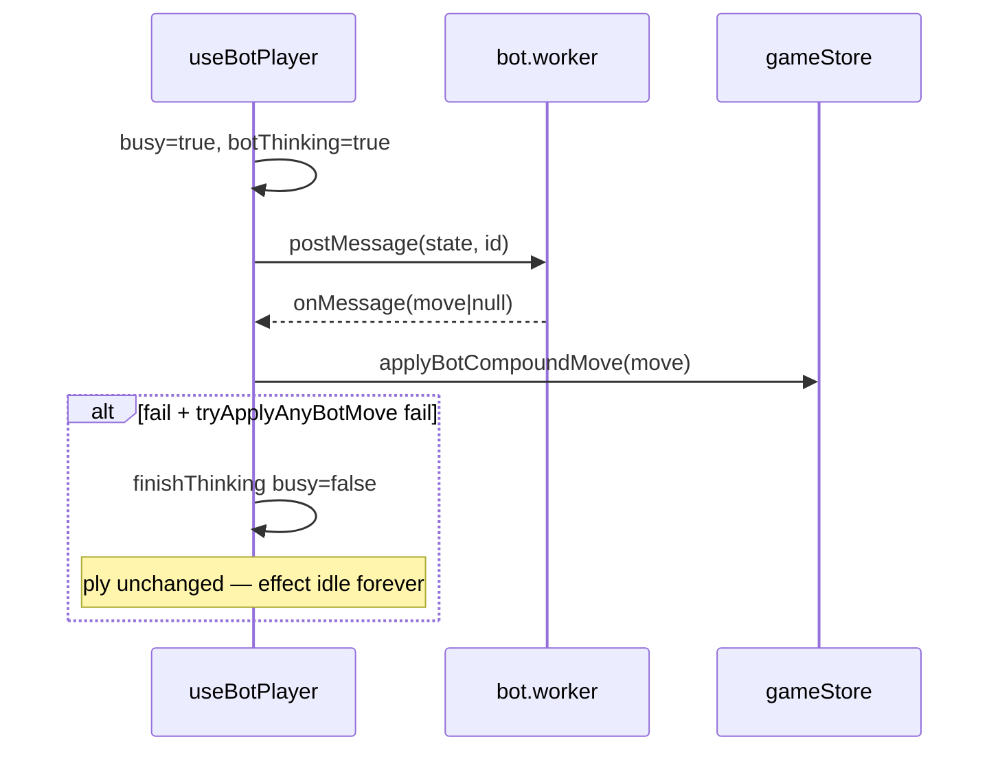
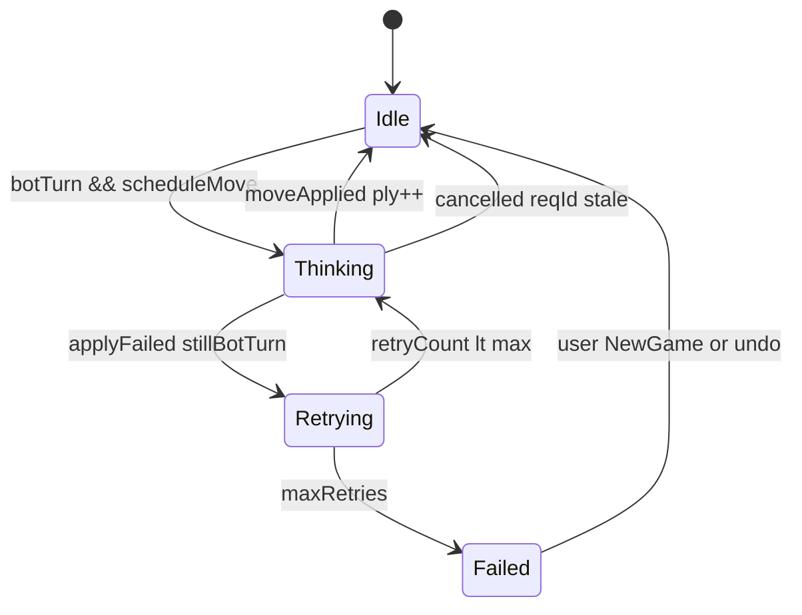
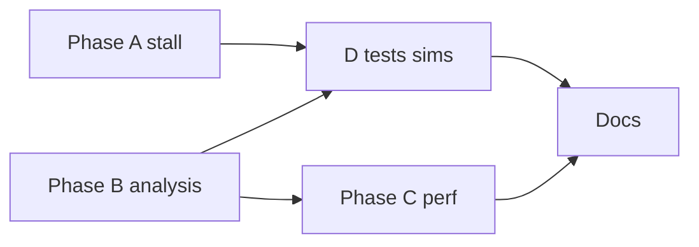

# Vs bot stall fix + Bot AI for rules 1.2.0 — Implementation plan

**Status:** **Implemented** (Phases A–E, rules **1.2.0**)  
**Scope:** `apps/web` (bot hook, worker, UX) + `packages/engine` (analysis line-length, eval perf, tests/sims)  
**Parent:** [IMPLEMENTATION_PLAN.md](../IMPLEMENTATION_PLAN.md), [docs/RULES.md](./RULES.md) (`rulesVersion` **1.2.0**)  
**Builds on:** [BOT_AI_IMPROVEMENT_PLAN.md](./BOT_AI_IMPROVEMENT_PLAN.md) (live eval, TT, ordering — **shipped**), [VS_BOT_MODE_FIX_PLAN.md](./VS_BOT_MODE_FIX_PLAN.md) (gating, atomic moves — **partially shipped**), [FLANKING_DIAGONALS_1_2_0_PLAN.md](./FLANKING_DIAGONALS_1_2_0_PLAN.md) (**9 lines/side**, 5-cell flanks — **shipped**)

### Revision history

| Version | Changes |
|---------|---------|
| **v1** | Stall root cause, phases A–E, 1.2.0 analysis + sims outline |
| **v2** | Shipped vs gap matrix; hook **state machine** + concrete API; code anchors; DoD; expanded test catalog; diagnose playbook; perf budget; PR split; fix line counts (9/side) |

---

## Table of contents

1. [Goals & definition of done](#1-goals--definition-of-done)  
2. [What’s shipped vs what’s broken](#2-whats-shipped-vs-whats-broken)  
3. [Problem & root cause](#3-problem--root-cause)  
4. [Rules 1.2.0 — bot impact](#4-rules-120--bot-impact)  
5. [Architecture target](#5-architecture-target)  
6. [Phase A — Vs bot stall (P0)](#6-phase-a--vs-bot-stall-p0)  
7. [Phase B — Line-length-aware analysis (P1)](#7-phase-b--line-length-aware-analysis-p1)  
8. [Phase C — Search performance (P1)](#8-phase-c--search-performance-p1)  
9. [Phase D — Tests, E2E, balance (P2)](#9-phase-d--tests-e2e-balance-p2)  
10. [Phase E — Docs (P2)](#10-phase-e--docs-p2)  
11. [Phases, estimates, PR strategy](#11-phases-estimates-pr-strategy)  
12. [Test catalog](#12-test-catalog)  
13. [Diagnose playbook](#13-diagnose-playbook)  
14. [Risks & FAQ](#14-risks--faq)  
15. [File checklist](#15-file-checklist)  
16. [Execution checklist](#16-execution-checklist)

---

## 1. Goals & definition of done

### 1.1 Player-visible outcomes

| # | Outcome | Verification |
|---|---------|--------------|
| G1 | Vs bot + **You P1** + **New game** → after one human move, **bot moves without** clicking P2 inventory | Manual + `e2e/vs-bot.spec.ts` |
| G2 | Banner **never** shows bare **“Player 2”** on bot seat for >3s while game is active | E2E + manual |
| G3 | Worker error / bad move → **retry or sync fallback**; game does not freeze | Manual + unit-style hook test optional |
| G4 | Bot **blocks / fights** on **5-cell flank** lines (not blind to `diag-se-ne` etc.) | Engine golden B* tests |
| G5 | Medium bot think **p95 ≤ ~2.5s** on dev laptop after C | Console timing / optional metric |
| G6 | `pnpm sim:bot` documented for **1.2.0**; win rate ≥ **85%** vs random at medium budget | `docs/BALANCE.md` |

### 1.2 Definition of done (ship gate)

- [x] **A** complete — G1–G3  
- [x] **B** complete — G4  
- [x] **D** — e2e spec updated; BALANCE bot row for 1.2.0  
- [x] **C** — presets + `fastEvalAtDepth` (see BALANCE)  
- [ ] No regression: `pnpm test` (engine) + `pnpm build`

### 1.3 Non-goals

- ML / self-play; server bot; new `rulesVersion`; optimal 6×6 solve

---

## 2. What’s shipped vs what’s broken

| Area | Shipped (do not redo) | Still broken / stale |
|------|------------------------|----------------------|
| **Vs bot input** | `canHumanAct`, `botThinking` blocks human on bot turn (`playVsBot.ts`, `PlayPage.tsx`) | Stall when bot fails silently |
| **Moves** | `applyBotCompoundMove` + `tryApplyAnyBotMove` fallback (`gameStore.ts`, hook) | **No retry** when fallback fails and `ply` unchanged |
| **Worker** | `chooseBotMove` + legal `moves[0]` in worker (`bot.worker.ts`) | Main thread may **`return` if `!worker`** (L69–70); no wall-clock timeout |
| **Search / eval** | Live `scoreLinesFromBoard`, TT, ordering, presets (`ai-search.ts`, `ai-eval.ts`) | **9 lines/side** cost; analysis still **6-slot** |
| **UX** | “Bot thinking…” when `botThinking` (`TurnBanner.tsx` L42–43) | Fallback **“Player N”** when bot turn && !thinking (L47–48) |
| **E2E** | `e2e/vs-bot.spec.ts` (one human move → bot fills) | No stall guard on banner text |
| **Rules** | Flanking diagonals, live score, 1.2.0 scorer | Bot **strength** not re-baselined |

---

## 3. Problem & root cause

### 3.1 User-confirmed symptom

**Vs bot**, **You play P1**, after your move: banner **“Player 2”**, board frozen.

Interpretation:

- `phase.player === 2` (bot seat when human is P1).  
- `botThinking === false` → not showing thinking line.  
- `ply` unchanged → bot `useEffect` in `useBotPlayer.ts` **does not re-fire** (deps: `ply`, `phasePlayer`, …).

### 3.2 Failure sequence (today)



### 3.3 Root-cause register

| ID | Cause | Code anchor | Fix phase |
|----|--------|-------------|-----------|
| **S1** | No retry when still bot to move after failed apply | `useBotPlayer.ts` L97–98, effect deps L132–141 | A |
| **S2** | `if (!worker) return` with no schedule | `useBotPlayer.ts` L69–70 | A |
| **S3** | Stale `reqId` / undo during think | L106–108, L79–84 | A (cancel) |
| **S4** | Banner hides bot-turn failure | `TurnBanner.tsx` L41–48 | A |
| **S5** | Search slow → user perception “broken” | `searchOptionsForDifficulty` + 9 lines | C |
| **B1** | `slotsLeft = 6 - filled` | `analysis.ts` L85–86 | B |
| **B2** | `canReachL5OnLine` requires total length 6 | `analysis.ts` L60, L62–63 | B |

**Not the stall:** 1.2.0 `evaluateGame` on full board (fixed in flanking ship). Partial-board search uses live eval.

---

## 4. Rules 1.2.0 — bot impact

| Item | 1.1.0 | 1.2.0 (today) |
|------|-------|----------------|
| Lines / side | 7 | **9** (6 ortho + 3 diags) |
| Flank diags | — | **5 cells**; complete at 5/5 |
| Live eval in search | `scoreLinesFromBoard` | Auto-includes flanks ✓ |
| Threat bands | 6-slot math | **Wrong on 5-cell lines** ✗ |
| Insights count | 7 | 9 per player in UI |

**Legality:** unchanged. **Heuristics + time budget** need Phase B + C.

---

## 5. Architecture target

### 5.1 Bot turn state machine (hook)



Expose to UI:

```typescript
type BotUiStatus = "idle" | "thinking" | "retrying" | "failed";

// useBotPlayer returns { botThinking, botStatus, botSeat, humanSeat }
// botThinking = status === "thinking" || status === "retrying" (for input gating)
```

### 5.2 Single entry: `scheduleBotMove(reason)`

Consolidate worker post + timeout + sync fallback:

1. Validate `mode === vsBot`, `phase.player === botSeat`, not ended.  
2. `busy = true`, set status `thinking`.  
3. `postMessage` with `reqId`; arm `setTimeout(timeMs + 750, onTimeout)`.  
4. **onTimeout:** terminate worker, recreate, **`tryApplyAnyBotMove`** on main thread.  
5. **onMessage:** clear timeout; apply move; if still bot turn → **retry** (status `retrying`, max 3) via `queueMicrotask` / `setTimeout(0)`.  
6. **onError:** same as timeout path.

### 5.3 Effect dependencies

Trigger `scheduleBotMove("turn")` when:

- `phasePlayer === botSeat` && !ended && mode vsBot  
- AND (`!busy` OR `retryScheduled`)  
- AND `workerReady`

Add **`workerReady`** state (true after worker constructed). Add optional **`botRetryToken`** increment on retry so effect can re-enter without fake `ply` change.

### 5.4 Turn banner rules (vs bot only)

| `botStatus` / condition | Headline |
|-------------------------|----------|
| human turn | `Your turn — Player {humanSeat}` |
| `thinking` | `Bot thinking…` |
| `retrying` | `Bot finishing move…` |
| `failed` | `Bot couldn’t move — try New game` |
| bot turn, idle (transient) | `Bot thinking…` (prefer never show bare Player N) |

Local 2P: keep `Player {activePlayer}`.

---

## 6. Phase A — Vs bot stall (P0)

**Est.:** 0.5–1 day · **Ship alone** as hotfix PR

### A.1 Refactor `useBotPlayer.ts`

| Task | Detail |
|------|--------|
| Extract | `scheduleBotMove`, `cancelInflight`, `handleWorkerMessage` |
| Retry | After failed apply, if `phase.player === botSeat`, retry ≤ **3**, then `failed` |
| Worker null | Set `workerReady` false until created; queue move when ready |
| Timeout | `botSearchOptions(difficulty).timeMs + 750` ms |
| Undo | `ply` decreases → cancel inflight, reset status |
| Export | `botStatus` for banner |

### A.2 `TurnBanner.tsx`

- Props: `botStatus?: BotUiStatus` (or derive from `botThinking` + new flag).  
- Replace L47–48 fallback for `isVsBot && activePlayer === botSeat`.

### A.3 `PlayPage.tsx` (optional)

- Pass `botStatus` to banner.  
- Optional toast on `failed` (non-blocking).

### A.4 Worker (`bot.worker.ts`)

- Already responds with fallback; ensure **`ok: false`** still includes **`move`** when legal exists.  
- Log `usedFallback` in dev only.

### A.5 Verification

| ID | Check |
|----|--------|
| A-manual | P1 vs bot, new game, one move → ≥2 cells filled ≤15s |
| A-console | No unhandled `Bot could not apply` without subsequent move |
| A-e2e | Extend vs-bot spec (see §12) |

---

## 7. Phase B — Line-length-aware analysis (P1)

**Est.:** 0.5–1 day · Depends on **A** for playtesting only

### B.1 `canReachL5OnLine` (`analysis.ts`)

**Today:** `partial.length + slotsLeft !== 6` (L60); full line check `partial.length !== 6` (L62).

**Change:**

```typescript
export function canReachL5OnLine(
  partial: TileValue[],
  slotsLeft: number,
  available: Record<TileValue, number>,
  lineLength: number, // 5 or 6
): boolean
```

Invariant: `partial.length + slotsLeft === lineLength`.

### B.2 `classifyLineBand`

Replace L85:

```typescript
const slotsLeft = lineLength - filled;
```

Thread `lineLength` from `analyzePositionForPlayerRaw` loop: `line.indices.length`.

### B.3 Callers

- `classifyLineBand(cells, inventory, lineLength)`  
- Update tests in `analysis.test.ts`  
- **`blocksOpponentCritical`** (`ai-ordering.ts`) — auto benefits from fixed bands

### B.4 UI — `LineInsightsPanel.tsx`

- Display **`{filled}/{lineLength}`** via lookup: `getScoringLines` by `line.lineId` or add `lineLength` to `LineInsight` (engine export — optional small type extend).

### B.5 Examples to encode in tests

| Line | Partial | Expect |
|------|---------|--------|
| `diag-se-ne` (5) | 4/5, inv has finishing tile | `critical` when L5 reachable |
| `diag-se-ne` (5) | 5/5 ghost (no tile left) | `threat` not `critical` |
| `row-0` (6) | 5/6 distinct | unchanged vs 1.1.0 fixtures |

---

## 8. Phase C — Search performance (P1)

**Est.:** 0.5 day · Measure **after B** (playtest flanks)

### C.1 Eval budget (recommended)

In `evaluatePosition` or `negamax` leaf:

| Depth | Eval |
|-------|------|
| Leaf / `depth === 0` | Full: live + lex + **insights** |
| `depth >= 1` | **Fast:** `evalLiveLevelDiff + evalLexBonus` only |

Add `SearchOptions.fastEvalAtDepth?: boolean` default **true** for web presets.

**Risk:** slightly weaker tactics on deep lines; mitigated by ordering still using `lineScoreDelta` at root.

### C.2 Presets (`searchOptionsForDifficulty`) — starting points

| Level | Current | Proposed (if p95 too high) |
|-------|---------|----------------------------|
| Easy | 200ms, d3, noise | unchanged |
| Medium | 600ms, d5 | **700ms, d4** |
| Hard | 1200ms, d6 | **1200ms, d5** |

Re-measure after C.1; document final values in BALANCE appendix.

### C.3 Main-thread emergency

Reuse existing `tryApplyAnyBotMove` in hook (imports `getLegalCompoundMoves` from engine) — no new export required.

---

## 9. Phase D — Tests, E2E, balance (P2)

**Est.:** 0.5 day

### D.1 Engine

- New `analysis-flank-bands.test.ts` or extend `analysis.test.ts` (catalog B1–B5).  
- Extend `ai-eval.test.ts`: flank fill moves eval; `blocksOpponentCritical` on 5-cell line.

### D.2 E2E (`e2e/vs-bot.spec.ts`)

```text
After human move:
  - NOT: role=status text exactly /^Player 2$/ for 5s
  - OR: cell count increases within 20s (existing)
Optional: data-testid="turn-bot-thinking" | "turn-bot-retrying"
```

Optional dev: `?botMs=100` read in `PlayPage` → override `botSearchOptions` for CI speed (document in plan, implement if flaky).

### D.3 Sims

```bash
pnpm sim:bot              # scripts/sim-bot-vs-random.ts
pnpm sim:bot-depth
```

Append **Bot AI (rulesVersion 1.2.0)** table to `docs/BALANCE.md`:

- games, seed, bot-ms, bot win % vs random  
- Gate: ≥ **85%** at medium-equivalent budget

---

## 10. Phase E — Docs (P2)

**Est.:** 0.25 day

- This plan → **Implemented** sections when done  
- `BOT_AI_IMPROVEMENT_PLAN.md` — 9 lines, link here  
- `VS_BOT_MODE_FIX_PLAN.md` — stall retry closed in A  
- `FLANKING_DIAGONALS` § bot — “re-baseline via BOT_VS_STALL…”

---

## 11. Phases, estimates, PR strategy

| Phase | Est. | PR |
|-------|------|-----|
| **A** | 0.5–1 d | **PR1 hotfix** — ship immediately |
| **B** | 0.5–1 d | PR2 engine + insights UI |
| **C** | 0.5 d | PR2 or PR3 with B if small |
| **D** | 0.5 d | With PR2/3 |
| **E** | 0.25 d | With any merge |

**Total:** ~2–3 days.



---

## 12. Test catalog

### Phase A (web)

| ID | Test |
|----|------|
| A1 | E2E: vs bot P1, no bare “Player 2” stall |
| A2 | E2E: ≥2 tiles after human move ≤20s |
| A3 | Manual: undo during bot think → no duplicate ply |
| A4 | Manual: switch Local 2P → Vs bot + new game → bot moves |

### Phase B (engine)

| ID | Test |
|----|------|
| B1 | `canReachL5OnLine` with `lineLength: 5` |
| B2 | Flank 4/5 critical vs ghost |
| B3 | Row 6-cell regression |
| B4 | `analyzePositionForPlayer` returns 9 insights |
| B5 | `blocksOpponentCritical` on single empty flank cell |
| B6 | `ai-eval` flank improves correct player eval |

### Phase D (sims)

| ID | Test |
|----|------|
| D1 | `sim:bot` 50 games seed 42 — record win % |
| D2 | `sim:bot-depth` hard vs easy ordering |

---

## 13. Diagnose playbook

When user reports **“stuck on Player 2”**:

1. Confirm **Vs bot** (not Local 2P); URL has no `?sandbox=1`.  
2. Confirm **You play P1** — if P2, banner should say **Your turn**.  
3. **New game** after mode switch.  
4. DevTools console: `Bot could not apply`, worker errors.  
5. If thinking forever: check **Hard** preset + CPU; Phase C.  
6. Breakpoint `useBotPlayer` L97 — if hit, **S1** confirmed → Phase A.

---

## 14. Risks & FAQ

| Risk | Mitigation |
|------|------------|
| Retry loop infinite | Max 3 retries + `failed` state |
| Weaker bot after fast eval | Root still full eval via ordering; sim gate |
| E2E flake | Easy preset, 20s timeout, optional `botMs` query |
| Strict Mode double worker | Single worker effect; cancel on cleanup |

**Did 1.2.0 break rules in worker?** Unlikely; stall is lifecycle.  
**Why plain “Player 2”?** `botThinking` false + TurnBanner else branch.  
**Must we do B before A?** No — **A first** for freeze; B for strength.

---

## 15. File checklist

| File | Phase | Change |
|------|-------|--------|
| `apps/web/src/hooks/useBotPlayer.ts` | A | State machine, retry, timeout, `botStatus` |
| `apps/web/src/components/game/TurnBanner.tsx` | A | Bot-turn copy |
| `apps/web/src/pages/PlayPage.tsx` | A | Pass `botStatus`; optional toast |
| `apps/web/src/workers/bot.worker.ts` | A | Response shape audit |
| `packages/engine/src/analysis.ts` | B | Line length |
| `packages/engine/src/types` or `LineInsight` | B | Optional `lineLength` field |
| `packages/engine/__tests__/analysis*.ts` | B | B1–B6 |
| `packages/engine/src/ai-eval.ts` / `ai-search.ts` | C | Fast eval flag + presets |
| `apps/web/src/components/game/LineInsightsPanel.tsx` | B | filled/N |
| `e2e/vs-bot.spec.ts` | D | A1–A2 |
| `docs/BALANCE.md` | D | 1.2.0 bot sim |
| `docs/BOT_AI_IMPROVEMENT_PLAN.md` | E | Cross-link |
| `docs/VS_BOT_MODE_FIX_PLAN.md` | E | Stall closed |

---

## 16. Execution checklist

- [x] **A** — Hook refactor + banner + manual G1–G3 (verify locally)  
- [x] **A** — E2E A1–A2 (spec updated; run `pnpm e2e` locally)  
- [x] **B** — Analysis line length + B1–B6  
- [x] **B** — Insights `filled/N`  
- [x] **C** — Fast eval + preset tune (medium 700ms/d4; hard d5)  
- [x] **D** — `sim:bot` → BALANCE 1.2.0 (20-game sample)  
- [x] **E** — Doc status updates  
- [x] **DoD** — §1.2 (G1–G6; spot-check G5 in play)  

**Next engine work:** [BOT_SEARCH_REVAMP_V3_PLAN.md](./BOT_SEARCH_REVAMP_V3_PLAN.md) — **canonical v3** (latency + intelligence); execute to completion.

---

## Appendix: current code references

**Hook early exit (S2):**

```69:70:apps/web/src/hooks/useBotPlayer.ts
    const worker = workerRef.current;
    if (!worker) return;
```

**Failed apply with no retry (S1):**

```97:98:apps/web/src/hooks/useBotPlayer.ts
      finishThinking();
      console.warn("Bot could not apply a move; no legal moves?");
```

**Banner stall UX (S4):**

```41:48:apps/web/src/components/game/TurnBanner.tsx
  if (isVsBot && !isHumanTurn && botThinking) {
    headline = `Bot thinking… (Player ${botSeat})`;
  } else if (isVsBot && isHumanTurn) {
    headline = `Your turn — Player ${humanSeat}`;
  } else {
    headline = `Player ${activePlayer}`;
```

**6-only reachability (B2):**

```54:64:packages/engine/src/analysis.ts
/** Whether `slotsLeft` placements from `available` can complete a 6-cell line with R≥5 or D≥5. */
export function canReachL5OnLine(
  partial: TileValue[],
  slotsLeft: number,
  available: Record<TileValue, number>,
): boolean {
  if (slotsLeft < 0 || partial.length + slotsLeft !== 6) return false;
  if (slotsLeft === 0) {
    if (partial.length !== 6) return false;
```
