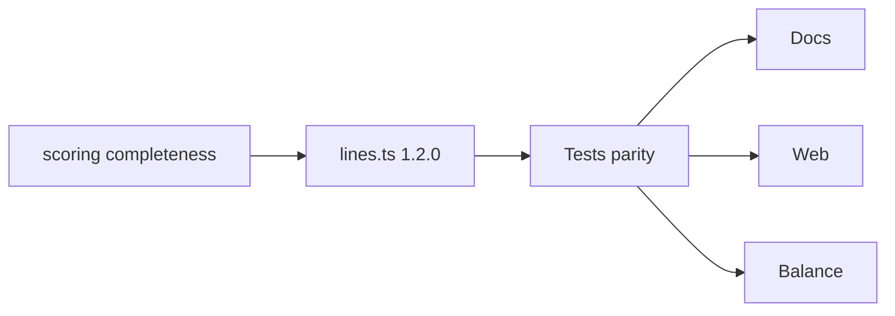

# Flanking diagonals (5-cell) — Implementation plan

**Status:** Implemented — `rulesVersion` **1.2.0** (9 lines per side: 6 + 3 diagonals)  
**Scope:** `@numchess/engine` (lines + **official scorer** + scoring invariants) + `apps/web` (copy, overlays, insights) + docs/replays/balance  
**Parent:** [IMPLEMENTATION_PLAN.md](../IMPLEMENTATION_PLAN.md), [docs/RULES.md](./RULES.md), [adr/005-rules-versioning.md](../adr/005-rules-versioning.md)  
**Builds on:** [SPLIT_DIAGONALS_AND_LIVE_SCORING_V2_PLAN.md](./SPLIT_DIAGONALS_AND_LIVE_SCORING_V2_PLAN.md) (`rulesVersion` **1.1.0**, live partial scoring, ↘/↙ split)  
**Related:** [BOT_AI_IMPROVEMENT_PLAN.md](./BOT_AI_IMPROVEMENT_PLAN.md) (eval uses `getScoringLines`; re-baseline sims after ship)  
**Target rules id:** **`rulesVersion` 1.2.0**

### Revision history

| Version | Changes |
|---------|---------|
| **v1** | Geometry, scoring semantics, phases, tests, balance, UI, migration |
| **v2** | **Fix official-scorer gap** (`isLineComplete` / `scorePerspective` today are 6-only); migration matrix; consumer map; overlap table; index builders; expanded tests + DoD; RULES FAQ; phase deps |

---

## Table of contents

1. [Goals & acceptance](#1-goals--acceptance)  
2. [Product summary](#2-product-summary)  
3. [Geometry on 6×6](#3-geometry-on-6×6)  
4. [Scoring rules (1.2.0)](#4-scoring-rules-120)  
5. [rulesVersion & migration](#5-rulesversion--migration)  
6. [Engine implementation](#6-engine-implementation)  
7. [Web & UX](#7-web--ux)  
8. [Bot, replay, balance](#8-bot-replay-balance)  
9. [Phases & estimates](#9-phases--estimates)  
10. [Tests catalog](#10-tests-catalog)  
11. [Definition of done](#11-definition-of-done)  
12. [Risks & FAQ](#12-risks--faq)  
13. [File checklist](#13-file-checklist)  
14. [Execution checklist](#14-execution-checklist)

---

## 1. Goals & acceptance

### 1.1 Problems we’re solving

| Gap | Today (1.1.0) | After 1.2.0 |
|-----|---------------|-------------|
| Diagonal tactics | One 6-cell ↘/↙ per side | **Three** parallel diagonals per side (6 + 5 + 5) |
| “Finish lines” beside rows/cols | Only main diag | **Two extra 5-cell** lines that can hit L5 at 5/5 |
| Plan accuracy | — | Official endgame must **score 5-index lines** (see §4.2 — not true in code yet) |

### 1.2 Target behavior (measurable)

- **`getScoringLines`:** exactly **11** lines per perspective; four new ids with **5** indices each.  
- **Live HUD / feed / insights:** unchanged pipeline (`scoreLiveLevels`, `lineScoreDelta`, `analyzePositionForPlayer`) — new lines appear automatically once registered in `lines.ts`.  
- **Full board:** `scoreLiveLevels(state).*` **===** `evaluateGame(state).levels.*` (extend existing golden test).  
- **Ownership:** P1 never scores `diag-sw*`; P2 never scores `diag-se*`.  
- **Replay:** new games persist `rulesVersion: "1.2.0"`; import of older versions **warns** (ADR-005).

### 1.3 Non-goals

Same as §4 in v1: no inventory change, no PartyKit, no silent re-grade of 1.1.0 replays, no alternate L5 rules on 5-cell lines unless a later variant id.

---

## 2. Product summary

### 2.1 Idea

Each player already owns **one main 6-cell diagonal** (P1 ↘, P2 ↙). Add **two parallel 5-cell diagonals** on each side of that main line (same direction, offset one step on the grid).

| Player | Orthogonals | Diagonals (new total) |
|--------|-------------|------------------------|
| **P1 (Rows)** | 6 rows | 1×6 ↘ + **2×5** ↘-parallel |
| **P2 (Cols)** | 6 columns | 1×6 ↙ + **2×5** ↙-parallel |

**11 scoring lines per side** (was 7 in 1.1.0).

Placement remains **any empty cell** for either player; only **which side’s L2–L5 buckets** receive a line’s R/D contributions changes by line ownership.

### 2.2 Why it’s exciting

- **Full 5-cell lines** can hit **L5 diversity** with five distinct values without a sixth cell — extra finish lines beside rows/cols/main diag.  
- **Overlapping cells** — one tile can sit on a row and one or two flanking diags (and near-center main diags) → denser tactics.  
- Same **R/D coexistence** and **live partial scoring** as 1.1.0 — no new formula family.

---

## 3. Geometry on 6×6

Index: `index = row * 6 + col` (0-based).  
Optional engine helper (recommended in Phase A):

```typescript
/** All board indices with (row - col) === k, in increasing row order. */
function indicesWithRowMinusCol(k: number): number[];
/** All board indices with (row + col) === k, in increasing row order. */
function indicesWithRowPlusCol(k: number): number[];
```

Generated lengths for `k ∈ {-1,0,1}` (↘ family) and `k ∈ {4,5,6}` (↙ family) must match the frozen tables below (tests are source of truth).

### 3.1 Player 1 — southeast (↘) family

Constant **`row - col`** along each parallel diagonal.

| Line id | Label (player-facing) | `row - col` | Len | Indices |
|---------|----------------------|-------------|-----|---------|
| `diag-se` | Diagonal ↘ | 0 | 6 | `0, 7, 14, 21, 28, 35` |
| `diag-se-ne` | ↘ upper | −1 | 5 | `1, 8, 15, 22, 29` |
| `diag-se-sw` | ↘ lower | +1 | 5 | `6, 13, 20, 27, 34` |

```text
(row,col) diag-se-ne: (0,1)(1,2)(2,3)(3,4)(4,5)
(row,col) diag-se-sw: (1,0)(2,1)(3,2)(4,3)(5,4)
```

### 3.2 Player 2 — southwest (↙) family

Constant **`row + col`**.

| Line id | Label | `row + col` | Len | Indices |
|---------|-------|-------------|-----|---------|
| `diag-sw` | Diagonal ↙ | 5 | 6 | `5, 10, 15, 20, 25, 30` |
| `diag-sw-nw` | ↙ upper | 4 | 5 | `4, 9, 14, 19, 24` |
| `diag-sw-se` | ↙ lower | 6 | 5 | `11, 16, 21, 26, 31` |

```text
(row,col) diag-sw-nw: (0,4)(1,3)(2,2)(3,1)(4,0)
(row,col) diag-sw-se: (1,5)(2,4)(3,3)(4,2)(5,1)
```

### 3.3 Overlap matrix (design)

Max **P1 lines through one cell** (examples):

| Index | (r,c) | P1 line ids |
|-------|-------|-------------|
| 14 | (2,2) | `row-2`, `diag-se` |
| 21 | (3,3) | `row-3`, `diag-se`, `diag-sw-se` *(P2 only for last)* |
| 15 | (2,3) | `row-2`, `diag-se-ne` |
| 20 | (3,2) | `row-3`, `diag-se-sw` |

Player-facing copy: *“One tile can count toward several of **your** lines at once.”* Opponent lines through the same cell do not add to your totals.

### 3.4 ASCII — P1 ↘ family (all three)

```text
  c0 c1 c2 c3 c4 c5
r0  M  u  ·  ·  ·  ·     M = main ↘ (6), u = upper flank (5)
r1  l  ·  ·  ·  ·  ·     l = lower flank (5)
r2  ·  ·  ·  ·  ·  ·
...
(M at (0,0); upper runs (0,1)…(4,5); lower runs (1,0)…(5,4).)
```

---

## 4. Scoring rules (1.2.0)

### 4.1 Live / partial (unchanged policy)

For each scoring line:

1. Walk `line.indices` in order; collect non-null cells → `cells[]`.  
2. If empty, skip.  
3. `analyzeLine(cells)` → add contributions to that side’s L2–L5.  

Applies to **5- and 6-index** lines identically. Insights / `canReachL5OnLine` use the same index lists.

### 4.2 Official endgame (**requires engine change**)

**Today:** `isLineComplete`, `scorePerspective`, and `scoreCompletedPerspective` treat “complete” as **`indices.length === 6`** and `getLineCells` length 6. That means a full board would **throw** in `scorePerspective` for 5-index flank lines (`Line … incomplete at scoring time`).

**1.2.0 spec:**

| Line kind | Officially scored when |
|-----------|-------------------------|
| Rows / cols / main diags | All **6** cells on that line filled |
| Flanking diags | All **5** cells on that line’s index list filled |

**Implementation rule:** line is complete iff `line.indices.every(i => board[i] !== null)` — **no hardcoded 6**.

Refactor targets in `packages/engine/src/scoring.ts`:

| Symbol | Change |
|--------|--------|
| `isLineComplete(board, indices)` | Complete when every index in **`indices`** is filled (any length 5 or 6) |
| `scorePerspective` | Require `getLineCells` length === **`line.indices.length`**, not `6` |
| `scoreCompletedPerspective` / `newlyCompletedEntries` | Drop `cells.length !== 6` guard; use line-aware completeness |

**Invariant (ship gate):** with `isBoardFull(board)`, every line has all its cells filled → `scoreLiveLevels` equals `evaluateGame` levels.

### 4.3 Examples on a **full 5-cell** ↘-parallel line

| Cells (in order) | R | D | Contributions |
|------------------|---|---|----------------|
| 1,2,3,4,5 | 1 | 5 | +1 L5 (diversity) |
| 3,3,3,3,3 | 5 | 1 | +1 L5 (repetition) |
| 1,1,2,3,4 | 2 | 4 | +1 L2 (rep) +1 L4 (div) |

### 4.4 Deferred variant (not 1.2.0)

Different tile sets or capped L5 on 5-cell lines only → separate `rulesVersion` or `GameVariant`; see non-goals.

### 4.5 Winner

Unchanged lexicographic compare on level counts (rows vs columns totals).

### 4.6 Player-facing FAQ (for RULES.md)

1. **Why three diagonals for my side?** Main ↘/↙ plus two shorter parallels — each scores separately when you fill that line.  
2. **Can I get L5 on a diagonal before it’s “full”?** Yes — live score uses filled cells only; five different values on a **5-cell** flank already give L5 diversity.  
3. **At game end, when does a flank count?** When all **five** cells of that flank are filled (board full guarantees this).  
4. **Does a tile on my row also count on my diagonal?** Yes, if that cell is on both lines.

---

## 5. rulesVersion & migration

### 5.1 Version bump

| `rulesVersion` | Lines / side | Notes |
|----------------|--------------|--------|
| **1.0.0** | 8 (shared diags) | Legacy replays |
| **1.1.0** | 7 (split main ↘/↙) | Current default on `main` |
| **1.2.0** | **11** (+4 flanking ×5) | This plan |

Dynamic live scoring remains tied to **presentation** (same R/D); the **bump** is because line sets and **official totals** on the same move list can change vs 1.1.0.

### 5.2 ADR-005 compliance

| Requirement | Action |
|-------------|--------|
| Don’t mutate 1.1.0 semantics in place | Bump `RULES_VERSION` to `"1.2.0"` only |
| Old replays | Import **warns**; playback uses stored actions + current engine (document winner/score drift vs 1.1.0) |
| CHANGELOG | `packages/engine/CHANGELOG.md` + RULES changelog row |
| Optional | `adr/007-flanking-diagonals-1-2-0.md` — geometry, 5 vs 6 completeness, parity invariant |

### 5.3 Cross-doc updates

- [SPLIT_DIAGONALS_AND_LIVE_SCORING_V2_PLAN.md](./SPLIT_DIAGONALS_AND_LIVE_SCORING_V2_PLAN.md) — add footnote: line **counts** superseded by 1.2.0; partial/live sections still valid.  
- [BOT_AI_IMPROVEMENT_PLAN.md](./BOT_AI_IMPROVEMENT_PLAN.md) — update “7 lines/side” references after implementation.

---

## 6. Engine implementation

### 6.1 `packages/engine/src/lines.ts`

- Add four index arrays (or generate via §3 helpers + constants for `k`).  
- Extend `getScoringLines("rows")`: after `diag-se`, push `diag-se-ne`, `diag-se-sw`.  
- Extend `getScoringLines("columns")`: after `diag-sw`, push `diag-sw-nw`, `diag-sw-se`.  
- **Labels:** distinct `label` strings (feed + endgame ledger); ids stable for tests/replay analytics.  
- Optional exports: `lineIndexCount(id)`, `isDiagonalLine(id)` for UI sorting.

**Order convention:** keep orthogonals first, then diagonals **main → upper → lower** (matches highlight cycling).

### 6.2 `packages/engine/src/scoring.ts` (**not** minimal)

See §4.2. Without this, Phase B parity tests **fail** on full board.

`scoreLinesFromBoard` / `lineScoreDelta` — **no logic change** once lines exist; new lines appear in ledgers with their labels.

### 6.3 Other engine modules

| Module | Change |
|--------|--------|
| `patterns.ts` | None |
| `analysis.ts` | Auto: 11 insights per player on empty board |
| `ai-eval.ts`, `ai-search.ts`, `ai-ordering.ts` | Auto via `getScoringLines` / `lineScoreDelta` |
| `constants.ts` | `RULES_VERSION = "1.2.0"` |

### 6.4 Consumers (auto-affected)

| Consumer | Effect |
|----------|--------|
| `evaluateGame` / EndScreen ledger | +4 entries per side when board full |
| `useLiveScore` (web) | Totals include flank partials |
| `ScoreFeed` | New labels on contribution change |
| `LineInsightsPanel` | 11 rows; debounce unchanged |
| `findLineIndices` (web) | Resolves new ids via engine |
| `pnpm sim:*` | Different win/draw stats → BALANCE.md |

### 6.5 Docs

- `packages/engine/CHANGELOG.md`  
- `docs/RULES.md` — header **1.2.0**, table **11 lines**, §4.6 FAQ  

---

## 7. Web & UX

### 7.1 Copy

| Location | Update |
|----------|--------|
| `RulesDialog.tsx` | P1: 6 rows + **3** ↘ lines; P2: 6 cols + **3** ↙ lines; endgame completeness **5 vs 6** |
| `AppTopBar.tsx` | e.g. “P1 rows + ↘×3 · P2 cols + ↙×3” |
| `HomePage.tsx` | One line on flanking diags / overlap |

### 7.2 Overlays & insights

| Item | Action |
|------|--------|
| `lib/lines.ts` `lineCategory` | New ids already match `diag-*` → `"diag"` (**verify** no prefix clash) |
| `LineInsightsPanel` | Expect **11** lines; summary `x/11 scoring` |
| Settings “Highlight diagonals” | One toggle highlights **all three** diag ids for active perspective (Phase D polish: optional main vs flank sub-toggle) |

### 7.3 Live score / feed

No structural change; confirm feed shows flank **labels** (e.g. “↘ upper”) on first placement.

### 7.4 E2E (optional, Phase E)

- Play one tile on `diag-se-ne` index `1`; assert feed or live L5 path when completing diversity (lightweight smoke in `e2e/`).

---

## 8. Bot, replay, balance

### 8.1 Bot

- Search/eval pick up lines automatically; expect **slightly** higher branching on tactical diagonals.  
- If `sim:bot` latency regresses, tune depth presets — **not** rules.

### 8.2 Replay

- New games: `rulesVersion: "1.2.0"`.  
- 1.1.0 import: warn; document that flank lines were not scored under old rules.

### 8.3 Balance acceptance (initial)

| Sim | Gate (tune after first run) |
|-----|-----------------------------|
| `pnpm sim:random --games 500 --seed 42` | \|P1 win% − 50%\| ≤ **5%** (same bar as 1.1.0) |
| Draw rate | Record in BALANCE.md; investigate if **> 15%** |
| `pnpm sim:bot` (medium budget) | Bot win vs random ≥ **85%** |

Append **1.2.0** section to [docs/BALANCE.md](./BALANCE.md); keep 1.1.0 table for comparison.

---

## 9. Phases & estimates

| Phase | Work | Est. | Depends on |
|-------|------|------|------------|
| **A0** | **`scoring.ts` line-aware completeness** + `isLineComplete` tests | 0.25 d | — |
| **A1** | `lines.ts` four lines + `RULES_VERSION` + geometry tests | 0.5 d | A0 |
| **B** | Parity + ownership + update `split-diagonals.test.ts` counts; add `flanking-diagonals.test.ts` | 0.5–1 d | A1 |
| **C** | RULES, CHANGELOG, ADR-007, cross-links | 0.25–0.5 d | B |
| **D** | Web copy + insights smoke (11 lines) | 0.5 d | B |
| **E** | Balance sims + optional E2E | 0.5 d | B |

**Total:** ~2.5–3.5 days.



**PR strategy:** one feature PR to `main` is fine; if reviewing load is high, split **A0+A1+B** (engine) then **C+D+E** (docs/web/balance) — do **not** ship web copy claiming 1.2.0 before engine bump merges.

---

## 10. Tests catalog

| ID | Test |
|----|------|
| G1 | `getScoringLines("rows").length === 11`; columns same |
| G2 | Each flank id has exactly **5** indices; `diag-se` / `diag-sw` still **6** |
| G3 | Frozen index arrays match §3 tables |
| G4 | Partial: fill 5/5 on `diag-se-ne` with 1–5 → live rows L5 ≥ 1 |
| G5 | **Full board** random/playout: `scoreLiveLevels` === `evaluateGame().levels` |
| G6 | P2 ledger never includes `diag-se-ne` when only that line filled on board |
| G7 | `analyzePositionForPlayer` → **11** insights per player (empty board) |
| G8 | **`isLineComplete`**: true for 5/5 flank indices; false at 4/5 |
| G9 | **`evaluateGame`** on full board does not throw; ledger includes 4 flank ids per side |
| G10 | **`lineScoreDelta`**: placing tile on flank changes feed entry with correct `label` |
| G11 | Update **`split-diagonals.test.ts`**: expect length **11** (or move 1.1.0 cases to archived fixture if we keep historical describe — prefer updating to 1.2.0) |
| G12 | **`ai-eval.test.ts`**: flank fill moves P1 eval; not credited to P2 |

**Known debt (optional same PR):** engine package `pnpm typecheck` failures in test typings — do not block 1.2.0 unless quick fix.

---

## 11. Definition of done

- [ ] `RULES_VERSION === "1.2.0"`; `pnpm test` (engine) green including G5/G8/G9  
- [ ] `docs/RULES.md` and CHANGELOG match §4.2 completeness wording  
- [ ] Web rules copy mentions **3 diagonals** and 5 vs 6 completion  
- [ ] Manual: finish a **5/5 flank** during play → live L5 visible; full game → endgame ledger lists flank lines  
- [ ] `docs/BALANCE.md` has 1.2.0 sim row  
- [ ] No regression: vs-bot still completes moves (`chooseBotMove` legal fallback)

---

## 12. Risks & FAQ

**Will games become too swingy?**  
More L5 endpoints → watch draw rate and average decisive level in sims.

**Do we need new tile counts?**  
No (36 cells unchanged).

**Highlight clutter?**  
11 lines × insights; optional flank sub-toggle later.

**Why not share flanks between players?**  
Preserves 1.1.0 split ↘/↙ design; symmetric +2 lines each.

**Implement without rulesVersion bump?**  
No — replay fairness (ADR-005).

**v1 plan said `isLineComplete` already works for length 5 — correct?**  
**No** — current code requires length 6; §4.2 is the fix (Phase A0).

---

## 13. File checklist

| File | Action |
|------|--------|
| `packages/engine/src/scoring.ts` | **Line-aware completeness** (A0) |
| `packages/engine/src/lines.ts` | Four new lines + labels |
| `packages/engine/src/constants.ts` | `1.2.0` |
| `packages/engine/__tests__/flanking-diagonals.test.ts` | **New** G1–G10 |
| `packages/engine/__tests__/live-scoring.test.ts` | G5, G8; extend `isLineComplete` |
| `packages/engine/__tests__/split-diagonals.test.ts` | Line count **11** |
| `packages/engine/__tests__/analysis.test.ts` | 11 insights |
| `packages/engine/__tests__/engine.test.ts` | Line count 11 |
| `packages/engine/__tests__/ai-eval.test.ts` | G12 |
| `packages/engine/CHANGELOG.md` | Entry |
| `docs/RULES.md` | 1.2.0 |
| `adr/007-flanking-diagonals-1-2-0.md` | Recommended |
| `IMPLEMENTATION_PLAN.md` | Link + line count note |
| `docs/SPLIT_DIAGONALS…` | Superseded count footnote |
| `docs/BOT_AI_IMPROVEMENT_PLAN.md` | 11 lines/side |
| `apps/web` RulesDialog, AppTopBar, HomePage | Copy |
| `docs/BALANCE.md` | Post-sim 1.2.0 |

`apps/web/src/lib/lines.ts` — likely **no code change** (prefix `diag-`); verify in Phase D.

---

## 14. Execution checklist

- [ ] **A0** — `scoring.ts` + `isLineComplete` unit tests  
- [ ] **A1** — `lines.ts` + `RULES_VERSION`  
- [ ] **B** — G1–G12 + analysis count  
- [ ] **C** — RULES + CHANGELOG + ADR-007  
- [ ] **D** — Web copy + 11-line insights smoke  
- [ ] **E** — `sim:random` + `sim:bot` → BALANCE.md  
- [ ] **DoD** — §11 manual flank + full-board parity  

---

## Reference: line count history

| rulesVersion | P1 lines | P2 lines | Diagonals |
|--------------|----------|----------|-----------|
| 1.0.0 | 8 | 8 | Both mains shared on both sides |
| 1.1.0 | 7 | 7 | One main each (↘ / ↙) |
| **1.2.0** | **9** | **9** | Main + 2 flanking ×5 each |
