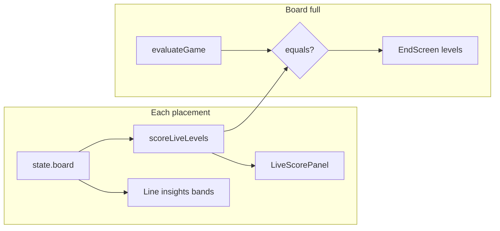

# Split diagonals & dynamic live scoring — Implementation plan

**Status:** Draft v2 — ready to execute  
**Scope:** `@numchess/engine` (rules + scoring API) + `apps/web` (HUD, copy, overlays, feed/audio) + docs/replays  
**Parent:** [IMPLEMENTATION_PLAN.md](../IMPLEMENTATION_PLAN.md), [docs/RULES.md](./RULES.md), [adr/005-rules-versioning.md](../adr/005-rules-versioning.md)  
**Supersedes (partially):** [docs/LIVE_SCORING_AND_AUDIO_PLAN.md](./LIVE_SCORING_AND_AUDIO_PLAN.md) §1.1 “completed lines only” for **live totals** (Howler/audio phases remain valid)

### Revision history

| Version | Changes |
|---------|---------|
| **v1** | Split diagonals + dynamic live score (outline) |
| **v2** | Product principles, partial-scoring examples, `lineScoreDelta` spec, migration/replay matrix, file checklist, FAQ, phased audio, ADR-006 draft, test catalog, bot/replay notes |

---

## 1. Goals & product principles

### 1.1 Problems we’re solving

| User report | Root cause today |
|-------------|------------------|
| “I had 1–5 on a row but Live score didn’t show L5” | Live HUD uses **`scoreCompletedLines`** (6/6 only) |
| “Diagonals should belong to one player” | Engine uses **shared diagonals** (ADR-002); prototype used **split** ↘/↙ |
| “Score should update every turn” | Totals **do** recompute each ply, but only **locked** lines count |

### 1.2 Target behavior (two bundled changes)

**A) Split diagonal ownership (`rulesVersion` **1.1.0**)**

| Player | Scoring lines (8 each) |
|--------|-------------------------|
| **P1 (Rows)** | 6 rows + **↘** `diag-se` only |
| **P2 (Columns)** | 6 columns + **↙** `diag-sw` only |

| Diagonal | Indices | Owner (scoring only) |
|----------|---------|----------------------|
| ↘ `diag-se` | 0, 7, 14, 21, 28, 35 | **P1** → Rows totals |
| ↙ `diag-sw` | 5, 10, 15, 20, 25, 30 | **P2** → Cols totals |

Placement: **any** player may play **any** empty cell. Ownership affects **which side’s L2–L5 buckets** receive that line’s R/D contributions.

**B) Dynamic live scoring (UX; same R/D formulas)**

- **Live score** = sum of **`analyzeLine(filled cells)`** contributions across **all 8 lines** of that side, recomputed **every ply** from `state.board`.
- **Not frozen** when a line hits 6/6: if **undo** or future variants changed cells, totals move (today only **undo**).
- **Endgame:** board full ⇒ live totals **must equal** `evaluateGame(state).levels` (official scorer still requires 6/6 per line).



### 1.3 Non-goals

- Ranked/Arena server, PartyKit, reserve variant rules  
- Changing R/D caps or lexicographic winner definition  
- Re-scoring imported **1.0.0** replays under **1.1.0** silently  

---

## 2. Scoring semantics (partial lines)

### 2.1 Rule (live + insights alignment)

For each scoring line:

1. Walk line indices in order; collect **non-null** cells → `cells[]` (0–6 length).  
2. If `cells.length === 0`, skip.  
3. Else `analysis = analyzeLine(cells)` — **same** function as full lines and `analyzePartialLine` in `analysis.ts`.  
4. Add each `analysis.contributions[]` entry to that side’s L2–L5 **counts** (+1 per contribution).

**Important:** This is **not** “guaranteed if completed” — it is **“current pattern on filled cells.”** Insights still add **reachability** (`canReachL5OnLine`, ghost threats); live HUD shows **numeric buckets only**.

### 2.2 Examples (Rows / one row)

| Filled cells on row (in order) | R | D | Live contributions added |
|--------------------------------|---|---|---------------------------|
| _(empty)_ | — | — | none |
| `1,2,3,4,5` (5 cells) | 1 | 5 | **+1 L5** (diversity) |
| `1,2,3,4,5,1` (6 cells) | 2 | 5 | **+1 L5** (diversity) **+1 L2** (repetition) |
| `3,3,3,3,3,3` | 5 | 1 | **+1 L5** (repetition) |
| `1,1,2,2` (4 cells) | 2 | 2 | **+1 L2** (both R and D at 2 — two contribution entries at L2) |

When the **sixth** tile lands on `1,2,3,4,5,_`, live score **updates** (e.g. may add **+1 L2** if sixth duplicates a value). That matches “dynamic, not frozen.”

### 2.3 When live ≠ “gut feel”

- **L5 diversity** on **five** cells means **five distinct values among filled cells**, not “tiles 1–5 used once each” if duplicates exist (e.g. `1,2,3,1,5` → D=4).  
- **Order** along the line does not matter for R/D (multiset).  
- **Diagonal ↘** only moves **Rows** column in HUD; **↙** only **Cols** — completing ↘ no longer bumps opponent’s L5.

Document these in **RULES.md** FAQ (§2.4 below).

### 2.4 Player-facing FAQ (copy for RULES.md)

1. **Why did L5 appear before the row was full?** Live score shows the **current** pattern on that line; five different values already give Level 5 diversity.  
2. **Why did a number drop after undo?** Live score recalculates from the board; undo removed tiles.  
3. **Who owns diagonals?** ↘ counts for **Rows (P1)**; ↙ for **Cols (P2)** only.  
4. **Does completing ↘ help my opponent’s column score?** **No** (under 1.1.0).

---

## 3. rulesVersion & migration

### 3.1 Version bump

| `rulesVersion` | Scoring lines | Live HUD policy (app) |
|----------------|---------------|-------------------------|
| **1.0.0** | Shared diagonals (both on both sides) | Shipped: completed-lines-only |
| **1.1.0** | Split ↘ / ↙ | Dynamic `scoreLiveLevels` |

**Single bump** for diagonal split. Dynamic live is **not** a separate rules version (official endgame unchanged; partial totals are presentation).

### 3.2 ADR-005 compliance

| Requirement | MVP approach | Follow-up (optional) |
|-------------|--------------|----------------------|
| Don’t mutate 1.0.0 | Change default `RULES_VERSION` to `1.1.0` only | `getScoringLines(rulesVersion)` registry |
| Old replays playable | Import **warns** (`replay.ts`); playback uses **stored** actions + **current** engine | Dual evaluator map for strict re-grade |
| CHANGELOG | `packages/engine/CHANGELOG.md` + RULES changelog | Golden replay fixtures per version |

**ADR-006 (new):** Split diagonals — supersede [adr/002-shared-diagonals.md](../adr/002-shared-diagonals.md).

### 3.3 Replay & sim impact

- **New exports:** `rulesVersion: "1.1.0"`.  
- **Import 1.0.0:** keep warning; document that **winner may differ** if re-evaluated (diagonal points move between sides).  
- **Balance:** re-run `pnpm sim:random --games 500 --seed 42`; append row to `docs/BALANCE.md` (draw rate, avg decisive level).

---

## 4. Engine design

### 4.1 `getScoringLines` (`packages/engine/src/lines.ts`)

```typescript
// rows:    6 × row-*  + diag-se
// columns: 6 × col-*  + diag-sw
// (remove second diagonal push for each perspective)
```

**Consumers (auto-affected by line sets):**

| Module | Effect |
|--------|--------|
| `scoring.ts` / `evaluateGame` | Official totals use new line sets on full board |
| `analysis.ts` | P1 insights exclude ↙; P2 exclude ↘ |
| `ai.ts` | Bot evaluation uses same 8 lines per side |
| `apps/web/lib/lines.ts` | Highlight: resolve `diag-se` only under `rows` search first |

### 4.2 Shared helper (recommended)

Add to `lines.ts` or `scoring.ts`:

```typescript
/** Filled tile values along line indices, in index order. */
export function getFilledLineCells(board: CellValue[], indices: number[]): TileValue[];
```

Use in `scoreLinesFromBoard`, and optionally refactor `analysis.ts` to avoid duplicating `getLineCells` behavior.

### 4.3 API surface (`scoring.ts`)

| Function | Purpose |
|----------|---------|
| `scoreLinesFromBoard(board, perspective)` | Ledger + level counts from **partial** lines |
| `scoreLiveLevels(state)` | `{ rows, columns }` for HUD |
| `lineScoreDelta(prev, next)` | Feed/audio: lines whose **contribution multiset** changed |
| `scoreCompletedLines(state)` | **Keep** — completed-only (tests, optional “strict mode”) |
| `linesNewlyCompleted` | **Deprecate for feed** → replace with `lineScoreDelta` in web |

**`lineScoreDelta` algorithm:**

1. Build maps `lineId → contributions[]` for P1 and P2 via `scoreLinesFromBoard` on `prev` and `next` (or diff ledgers).  
2. For each line id in union of keys, compare serialized contributions (level + kind).  
3. Emit ledger entries for lines **added/changed** on `next` (for feed text).  
4. Optional: emit “removed” on undo for feed (or clear feed on undo — **current UX**).

**Export** new symbols from `packages/engine/src/index.ts`.

### 4.4 Official endgame (unchanged path)

`scorePerspective` / `evaluateGame` on **full board**:

- Still requires **6 cells** per line (`getLineCells` length 6).  
- With split diagonals, P1 ledger has 7 row lines + ↘ only; P2 has 7 col lines + ↙ only.

**Invariant:** `scoreLiveLevels(state).levels === evaluateGame(state).levels` when `isBoardFull(state.board)`.

### 4.5 Test catalog

**New:** `packages/engine/__tests__/split-diagonals.test.ts`

| # | Case |
|---|------|
| S1 | `getScoringLines("rows")` ids: 6 rows + `diag-se`, no `diag-sw` |
| S2 | `getScoringLines("columns")` ids: 6 cols + `diag-sw`, no `diag-se` |
| S3 | Board with only ↘ full: rows L* increases; columns unchanged from ↘ |
| S4 | Board with only ↙ full: columns L* increases; rows unchanged from ↙ |

**Extend:** `live-scoring.test.ts`

| # | Case |
|---|------|
| L1 | Partial row `1..5` in five cells → `scoreLiveLevels.rows[5] >= 1` |
| L2 | Add sixth `1` → rows L5 unchanged, L2 increases by 1 |
| L3 | Full random game → `scoreLiveLevels` === `evaluateGame` |
| L4 | `lineScoreDelta` fires on ply that adds L5 diversity to partial row |
| L5 | Remove **both-players-on-diag-se** test; replace with S3/S4 |

**Regression:** `engine.test.ts` still expects **8 lines** per perspective (count unchanged).

---

## 5. Web integration

### 5.1 Live HUD

| File | Change |
|------|--------|
| `hooks/useLiveScore.ts` | `scoreLiveLevels` + `liveScoreLeader` |
| `LiveScorePanel.tsx` | Subtitle: **“Updates each turn from current patterns”**; optional `aria-live="polite"` on change |
| `PlayPage.tsx` | Replace `linesNewlyCompleted` with `lineScoreDelta` for feed; **undo** → clear feed (keep) |
| `lib/scoreFeed.ts` | `formatLineLockEntry` → optional `{filled}/6`; show **delta** not only lock |

**Pulse animation:** trigger on **level bucket** increase (compare prev/next live counts), not only feed length.

### 5.2 Copy & rules UI (checklist)

- [ ] `docs/RULES.md` — scoring table + FAQ §2.4 + **1.1.0** changelog  
- [ ] `components/RulesDialog.tsx`  
- [ ] `components/layout/AppTopBar.tsx`  
- [ ] `README.md`  
- [ ] `IMPLEMENTATION_PLAN.md` §0.1 — note split diagonals shipped  
- [ ] `packages/engine/src/analysis.ts` header comment — partial R/D also drives **live totals** (not “not used for scoring” globally)

### 5.3 Overlays & highlights

| File | Change |
|------|--------|
| `lib/lines.ts` | `findLineIndices(lineId)`: try `rows` for `diag-se`, `columns` for `diag-sw`; rows/cols as today |
| `LineInsightsPanel` | Tooltip: “↘ P1 scoring line” / “↙ P2 scoring line” on diag overlays |
| `SettingsSheet` | Optional rename “Highlight diagonals” → “Highlight scoring diagonals (↘ P1, ↙ P2)” |

### 5.4 Audio (Phase 2b — recommended)

| Event | SFX |
|-------|-----|
| Contribution **gain** on a line (incl. partial L5) | `line_lock` + optional `level_4` / `level_5` |
| Line reaches **6/6** | no extra beyond delta (avoid double) |
| **Undo** | `undo`; reset line debouncers |

**Debounce key:** `${lineId}:${level}:${kind}` per ply window.

### 5.5 E2E

| Spec | Steps |
|------|--------|
| `e2e/live-score.spec.ts` (new) | `/play?sandbox=1`; fill one row with five distinct values; assert `live-score-panel` Rows L5 ≥ 1 before sixth cell |
| `e2e/smoke.spec.ts` | Keep redirect test |

### 5.6 Replay scrubber (future)

If replay review stays on `scoreCompletedLines`, switch scrub step to `scoreLiveLevels` for consistency (Phase 3 optional).

---

## 6. Documentation deliverables

1. **`adr/006-split-diagonals.md`** — decision, consequences (draw rate, center tension).  
2. **`adr/002-shared-diagonals.md`** — status **Superseded by ADR-006**.  
3. **`NUMCHESS_DESIGN_DOCUMENT.md`** — footnote on Classic **1.1.0** vs §4.3 shared wording.  
4. **`docs/ACCESSIBILITY.md`** — live region when buckets change.  

---

## 7. Implementation phases

### Phase 1 — Engine (1 day)

- [ ] `getFilledLineCells` + `getScoringLines` split  
- [ ] `scoreLinesFromBoard`, `scoreLiveLevels`, `lineScoreDelta`  
- [ ] `RULES_VERSION = "1.1.0"`  
- [ ] Tests S1–S4, L1–L5  
- [ ] CHANGELOG + RULES.md + FAQ  

### Phase 2 — Web HUD & copy (1 day)

- [ ] Wire `useLiveScore` / feed / panel subtitle  
- [ ] RulesDialog, AppTopBar, README  
- [ ] `findLineIndices` diag ownership  
- [ ] E2E live-score spec  

### Phase 2b — Audio alignment (0.5 day)

- [ ] `lineScoreDelta` → `useGameAudio` fanfare rules + debounce  

### Phase 3 — Docs & balance (0.5 day)

- [ ] ADR-006 + supersede ADR-002  
- [ ] `pnpm sim:random` → BALANCE.md  
- [ ] IMPLEMENTATION_PLAN checklist  

**Total:** ~3 days.

---

## 8. Acceptance checklist

- [ ] ↘ → **Rows only**; ↙ → **Cols only** (engine + UI copy)  
- [ ] Five-cell row with five distinct values → **Rows L5 ≥ 1** in live panel  
- [ ] Sixth cell can change L2/L4/etc.; HUD updates same ply  
- [ ] Undo clears feed; live totals recalc down  
- [ ] Full board: live === end === `evaluateGame`  
- [ ] New games `rulesVersion` **1.1.0**; import warns on mismatch  
- [ ] `pnpm test` + `pnpm test:e2e` green  

---

## 9. Risks & mitigations

| Risk | Mitigation |
|------|------------|
| Players confuse live vs official before game end | Subtitle + RULES FAQ; end screen still authoritative at ply 36 |
| Partial scoring increases sum vs endgame | Full-board invariant test L3; counts match when all lines full |
| Feed spam | `lineScoreDelta` + debounce; mute settings |
| Bot strength shifts | Accept; re-run sim; no separate bot patch required |
| 1.0.0 replay trust | Warn on import; don’t auto-migrate outcomes |
| `analysis.ts` comment stale | Update in Phase 2 |

---

## 10. References

| Area | Path |
|------|------|
| Lines | `packages/engine/src/lines.ts` |
| R/D | `packages/engine/src/patterns.ts` |
| Live (today) | `scoreCompletedLines`, `apps/web/src/hooks/useLiveScore.ts` |
| Insights | `packages/engine/src/analysis.ts` |
| Bot | `packages/engine/src/ai.ts` |
| Replay warn | `apps/web/src/lib/replay.ts` |
| Prior plan | [LIVE_SCORING_AND_AUDIO_PLAN.md](./LIVE_SCORING_AND_AUDIO_PLAN.md) |

---

## 11. Next step

Execute **Phase 1** (engine + tests + `1.1.0`), then **Phase 2** (HUD + copy + E2E), then **2b** (audio deltas).

*Last updated: 2026-09-14 (v2)*
