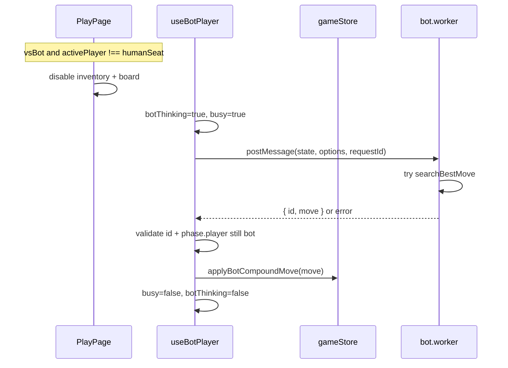

# Vs bot mode — Reliability & UX fix plan

**Status:** Draft v1 — ready to execute  
**Scope:** `apps/web` (PlayPage, hooks, store, worker, UI) + small `packages/engine` surface (optional `applyCompoundMove` in store path)  
**Parent:** [IMPLEMENTATION_PLAN.md](../IMPLEMENTATION_PLAN.md) §12, [docs/BOT_AI_IMPROVEMENT_PLAN.md](./BOT_AI_IMPROVEMENT_PLAN.md) (search strength — keep; fix delivery)  
**Related:** [SPLIT_DIAGONALS_AND_LIVE_SCORING_V2_PLAN.md](./SPLIT_DIAGONALS_AND_LIVE_SCORING_V2_PLAN.md) (did **not** change bot wiring; confusion often coincides with 1.1.0 playtesting)

### Revision history

| Version | Changes |
|---------|---------|
| **v1** | Root-cause analysis, input gating, worker reliability, atomic bot moves, UX, tests |

---

## Table of contents

1. [Problem statement](#1-problem-statement)  
2. [Root causes (confirmed in code)](#2-root-causes-confirmed-in-code)  
3. [Goals & non-goals](#3-goals--non-goals)  
4. [Architecture target](#4-architecture-target)  
5. [Phase A — Bot move pipeline (reliability)](#5-phase-a--bot-move-pipeline-reliability)  
6. [Phase B — Human input gating](#6-phase-b--human-input-gating)  
7. [Phase C — UX & mode clarity](#7-phase-c--ux--mode-clarity)  
8. [Phase D — Interactive search budget](#8-phase-d--interactive-search-budget)  
9. [Phase E — Tests & verification](#9-phase-e--tests--verification)  
10. [Files, risks, acceptance](#10-files-risks-acceptance)  
11. [Execution checklist](#11-execution-checklist)

---

## 1. Problem statement

### 1.1 User reports

| Report | Interpretation |
|--------|----------------|
| Vs bot selected but plays like **Local 2P** | Human can act on **both** seats; bot often does not auto-move |
| Turn **starts on Player 2** sometimes | `openingSwap` / `randomFirstPlayer` in saved settings — not bot-specific |
| After playing P2, then P1, then P2… | Normal alternation when **human** drives both sides |
| Worked before recent engine/web work | **Regressed** after bot AI worker/options + heavier search; split-diags plan did not edit `useBotPlayer` |

### 1.2 Success criteria (player-visible)

1. With **Vs bot** + **New game**, the **bot seat moves by itself** within the configured time budget (Easy ≤ ~1s typical, Medium ≤ ~2s, Hard ≤ ~3s wall clock per bot turn).  
2. Human **cannot** select tiles or place on the **bot seat’s** turn (mouse, touch, keyboard).  
3. Banner/copy distinguishes **You (Rows/Cols)** vs **Bot** on bot turn.  
4. Worker failure **does not** permanently disable the bot (`busy` stuck).  
5. Undo / new game / mode switch leave worker and bot state consistent.

---

## 2. Root causes (confirmed in code)

```text
PlayPage
  useBotPlayer(mode, difficulty, humanSeat)     ← only runs when mode === "vsBot"
  inventoryProps / Board                        ← NO humanSeat check
  handleInventorySelect / onPlace               ← always wired
```

| # | Cause | Location | Effect |
|---|--------|----------|--------|
| R1 | **No input gating** | `PlayPage.tsx`, `Board.tsx`, `useBoardKeyboard.ts` | Human plays bot seat → feels like 2P |
| R2 | **`busy` stuck true** if worker never replies | `useBotPlayer.ts` | After one failed turn, bot never retries |
| R3 | **No `worker.onerror` / try/catch** | `bot.worker.ts`, hook | Silent failure → R2 |
| R4 | **`move === null`** clears busy but **does not retry** | `useBotPlayer.ts` | Bot seat stuck until human moves |
| R5 | **Two-step `selectTile` + `placeAt`** | `useBotPlayer.ts` | Race with human input; illegal second step fails silently in store |
| R6 | **Heavy search** (depth 7–10, insight eval per node) | `ai-search.ts` / worker | Long hangs; user clicks before reply → stale `postMessage` (wrong `id` or illegal apply) |
| R7 | **Turn label “Player N”** only | `TurnBanner.tsx` | No “Bot thinking…” / “Your turn” |
| R8 | **First player P2** | `resolveFirstPlayer` + localStorage | Human (P1) sees P2 first → plays wrong seat if ungated |

**Not a root cause:** split diagonals / `scoreLiveLevels` (no changes to bot hook). May affect **perceived** fairness only.

---

## 3. Goals & non-goals

### 3.1 Goals

- Make Vs bot **functionally distinct** from Local 2P.  
- Harden worker lifecycle (errors, cancellation, stale responses).  
- Apply bot moves **atomically** via `applyCompoundMove`.  
- Keep bot **strength** from [BOT_AI_IMPROVEMENT_PLAN.md](./BOT_AI_IMPROVEMENT_PLAN.md); tune **interactive** time/depth separately from batch sims if needed.

### 3.2 Non-goals

- Rewriting negamax or training ML  
- Online multiplayer bot  
- Forcing first player to human seat (optional UX hint only)  
- Removing Local 2P mode

---

## 4. Architecture target



| Concept | Rule |
|---------|------|
| `humanSeat` | From settings; only this seat accepts input in vsBot |
| `botSeat` | `humanSeat === 1 ? 2 : 1` |
| `botThinking` | True from postMessage until move applied or error handled |
| Stale response | Drop if `requestId !== id` **or** `phase.player !== botSeat` |

---

## 5. Phase A — Bot move pipeline (reliability)

### A.1 Store: atomic bot move

Add to `gameStore.ts`:

```ts
applyBotCompoundMove(move: CompoundMove): boolean
```

- Read current state; if `phase.player` not bot (caller passes check) return false.  
- `next = applyCompoundMove(state, move)`; if null return false.  
- Single `set({ state: next, undoStack: [...], selectedTile: null })` — one history entry per bot turn.

Export from store; use **only** from `useBotPlayer` (not human UI).

### A.2 Worker hardening

`bot.worker.ts`:

```ts
self.onmessage = (event) => {
  try {
    const { id, state, player, options } = event.data;
    const move = searchBestMove(state, player, options ?? {});
    self.postMessage({ id, move, ok: true });
  } catch (err) {
    self.postMessage({ id: event.data?.id, move: null, ok: false, error: String(err) });
  }
};
```

Extend `BotWorkerResponse`: `{ id, move, ok?, error? }`.

### A.3 `useBotPlayer` rewrite

| Behavior | Spec |
|----------|------|
| `requestId` | Monotonic; include in request and validate on response |
| `busy` | Set true before postMessage; **always** false in `finally` (message, error, timeout) |
| Stale guard | Ignore response if `phase.player !== botSeat` or `id !== requestId` |
| Apply move | `applyBotCompoundMove(move)` only if move non-null |
| Retry | On `!ok` or null move: **one** immediate retry with `easyTopK` / reduced depth; then log + toast “Bot failed to move” (dev: console) |
| Timeout | `setTimeout(timeMs + 500)` on main thread: if still busy, terminate worker, recreate, clear busy, optional retry |
| Cleanup | On unmount / mode !== vsBot: terminate worker, clear busy |
| Dependencies | Prefer `state.ply` + `phase.player` + `phase.kind` over whole `phase` object if needed to reduce double-fires |

**Remove:** `selectTile` + `placeAt` from bot handler.

### A.4 Phase A acceptance

- [ ] Simulate worker throw → bot retries or toast; human can still play **their** turn next ply  
- [ ] No path leaves `busy === true` after 5s idle on bot turn

---

## 6. Phase B — Human input gating

### B.1 PlayPage

Compute:

```ts
const isVsBot = effectiveMode === "vsBot";
const humanSeat = settings.humanSeat;
const botSeat = humanSeat === 1 ? 2 : 1;
const canHumanAct =
  !isVsBot ||
  (activePlayer === humanSeat && !botThinking);
```

- `handleInventorySelect`: if `!canHumanAct` return early.  
- `Board` `onPlace`: if `!canHumanAct` return.  
- `inventoryProps(player)`: `isTurn: activePlayer === player && canHumanAct` (or dim bot panel always except when bot thinking indicator on bot side — product choice).

Pass `canHumanAct` or `disabled={!canHumanAct}` into `Board` (new prop `interactionDisabled`).

### B.2 Keyboard

`useBoardKeyboard.ts`: accept optional `enabled: boolean` from PlayPage (`canHumanAct && placing`).

`useGameKeyboard` (undo, etc.): allow undo on human turn only in vsBot, or allow undo always but document bot `busy` reset on undo (reset `busy` + increment requestId on undo).

### B.3 Phase B acceptance

- [ ] Vs bot: on bot turn, clicks on both inventories and board do nothing  
- [ ] Local 2P unchanged

---

## 7. Phase C — UX & mode clarity

### C.1 Turn banner

When `vsBot`:

| Condition | Copy (example) |
|-----------|----------------|
| Human turn, select | **Your turn** — Player {humanSeat} · choose a tile |
| Human turn, place | **Your turn** — place {heldTile} |
| Bot turn, thinking | **Bot thinking…** (Rows/Cols label for bot seat) |
| Bot turn, not thinking (error) | **Bot stalled** — retry or new game |

Optional `data-testid="turn-bot-thinking"`.

### C.2 Mode switch

`setGameMode("vsBot")` already calls `startNewGame()` — ensure `useBotPlayer` receives updated mode on same tick (optional: pass `gameMode` into `startNewGame` patch so first render is vsBot).

### C.3 Settings hint (Vs bot panel)

One line: “Opening swap / random first can start on P2.” Link to settings sheet toggles.

### C.4 Phase C acceptance

- [ ] Playtest: user never needs to guess which side is bot

---

## 8. Phase D — Interactive search budget

Bot AI plan optimized for strength; Vs bot needs **responsive** moves.

### D.1 Separate presets

In `searchOptionsForDifficulty` (engine) or `botSearchOptions` (web override):

| Difficulty | `timeMs` | `maxDepth` | Notes |
|------------|----------|------------|--------|
| easy | 200 | 3 | noise top 3 |
| medium | 600 | 5 | TT on |
| hard | 1200 | 6 | TT on; cap wall 2.5s with timeout in hook |

Keep **sim scripts** on higher budgets via explicit CLI flags (do not use interactive presets in `sim:bot-depth`).

### D.2 Optional: fast eval in worker

If still slow: add `SearchOptions.evalMode: "fast" | "full"` — fast skips `evalInsightTerms` below depth 2 (engine-only). Default **`fast`** for web worker; sims use `full`.

Defer if Phase D.1 enough.

### D.3 Phase D acceptance

- [ ] Medium bot move completes in ≤ 2s on empty-ish board in Chrome desktop devtools  
- [ ] `pnpm sim:bot` still passes threshold with `--bot-ms 200` (sim preset unchanged)

---

## 9. Phase E — Tests & verification

### E.1 Unit / component (Vitest + RTL if present)

| Test | Idea |
|------|------|
| `canHumanAct` logic | Pure function test in `playVsBot.ts` helper |
| Store `applyBotCompoundMove` | Legal move advances ply; illegal returns false |

### E.2 Playwright E2E (new or extend `e2e/`)

```text
1. Go /play
2. Click mode-vsbot, seat-p1, New game
3. Make one human move (p1 tile + cell)
4. Expect turn-bot-thinking OR board disabled within 500ms
5. Within 15s expect ply increased without human clicking p2 inventory
```

Use **easy** difficulty + mock worker only if flakiness — prefer real worker with short `timeMs` in test settings injection (query param `?botMs=50` optional dev hook).

### E.3 Manual rubric (5 min)

- [ ] Vs bot, P1, new game, never click P2 — game progresses  
- [ ] Hard refresh mid-game vs bot — no duplicate moves  
- [ ] Switch Local 2P ↔ Vs bot — bot activates after new game

---

## 10. Files, risks, acceptance

### 10.1 File checklist

| File | Change |
|------|--------|
| `apps/web/src/store/gameStore.ts` | `applyBotCompoundMove` |
| `apps/web/src/hooks/useBotPlayer.ts` | Reliability rewrite, export `botThinking` |
| `apps/web/src/workers/bot.worker.ts` | try/catch response shape |
| `apps/web/src/pages/PlayPage.tsx` | Gating, pass props, optional `botThinking` |
| `apps/web/src/components/game/Board.tsx` | `interactionDisabled` |
| `apps/web/src/components/game/TurnBanner.tsx` | Vs bot copy |
| `apps/web/src/hooks/useBoardKeyboard.ts` | `enabled` flag |
| `apps/web/src/lib/playVsBot.ts` (new) | `canHumanAct`, `botSeatFor` helpers |
| `packages/engine/src/ai-search.ts` | Interactive presets / optional fast eval |
| `apps/web/src/lib/persistence.ts` | Document or tune `botSearchOptions` |
| `e2e/vs-bot.spec.ts` (new) | E2E above |
| `docs/BOT_AI_IMPROVEMENT_PLAN.md` | Cross-link “delivery fix” |

### 10.2 Risks

| Risk | Mitigation |
|------|------------|
| E2E flaky on slow CI | Easy preset + 15s timeout + `--bot-ms` query |
| Terminate/recreate worker often | Only on timeout/error path |
| Undo during bot think | Cancel pending requestId; clear busy |

### 10.3 Ship acceptance

- [ ] All existing tests + new E2E green  
- [ ] Manual rubric signed off  
- [ ] No regression Local 2P / sandbox

**Estimate:** Phase A–B **1–1.5 days**; C **0.5 day**; D **0.5 day**; E **1 day** → **~3–4 days**.

---

## 11. Execution checklist

**Phase A — Pipeline**

- [ ] `applyBotCompoundMove` in store  
- [ ] Worker try/catch + response shape  
- [ ] Hook: id guard, finally busy, atomic apply, retry/timeout  

**Phase B — Gating**

- [ ] `canHumanAct` helper  
- [ ] PlayPage + Board + keyboard  

**Phase C — UX**

- [ ] TurnBanner vs bot strings  
- [ ] Optional settings hint  

**Phase D — Budget**

- [ ] Lower interactive depth/time  
- [ ] Sims keep separate flags  

**Phase E — Tests**

- [ ] E2E vs bot  
- [ ] Manual rubric  

---

## FAQ

**Does split diagonals break Vs bot?**  
No code path change to the hook. Fix delivery and UX regardless of rules version.

**Cross-link:** After ship, add one line to [BOT_AI_IMPROVEMENT_PLAN.md](./BOT_AI_IMPROVEMENT_PLAN.md) §Ship pointing here for interactive delivery.

**Revert bot AI to fix?**  
Not required. Fix R1–R6; tune D if slow.

**Should bot use main thread?**  
No — keep worker; fix message handling and budgets.
